<p align="center">
  
</p>

<div align="center" style="line-height: 1;">
  
  
  
  
  
  
  
</div>

---

# Myrmecia — Self-hosted Agent Ops for AI agent teams

> *Formerly **Agent Factory**.* Myrmecia is a local-first control plane for running, governing, observing, and improving fleets of AI agents.

Myrmecia is not another agent SDK and it is not a single coding assistant. It is the **Agent Ops layer** around the agents you already use or build: queue work, route it to specialist agents, run PM → Design → Dev → QA pipelines, inspect every trace, control tool permissions, manage memory, and keep humans in the loop from one self-hosted dashboard.

| If you have... | Myrmecia gives you... |
| --- | --- |
| Claude Code, Gemini CLI, Codex, OpenCode, or custom agents | A control plane to schedule, govern, observe, and coordinate them |
| Multi-step product/engineering work | Agent teams, pipelines, DAG orchestration, shared boards, and resumable runs |
| Security or compliance requirements | Tool policy, DLP, audit trails, RBAC, workspace isolation, and cost guardrails |
| Long-running agent workflows | Durable tasks, execution timelines, memory, checkpoints, and recovery hooks |

## Why teams use it

- **Run agent teams, not just prompts** — built-in PM, UI, Dev, QA, Ops, Review, content, security, accessibility, and domain-specialist agents.
- **Govern every tool call** — workspace-confined engineering tools, per-agent allowlists, approval gates, DLP, audit logs, and policy snapshots.
- **Observe the whole run** — live WebSocket events, execution timelines, trace spans, cost dashboards, task logs, inbox decisions, and rollback checkpoints.
- **Keep context alive** — four-layer memory, domain packs, RAG citations, context compaction, and post-run reflection.
- **Stay self-hosted** — SQLite by default, Redis when configured, optional model gateway, and no mandatory hosted control plane.

## Quickstart

```bash
git clone https://github.com/Zchary1106/Myrmecia.git
cd Myrmecia

pnpm install
pnpm demo
# Seeds deterministic demo data, starts the API + dashboard, then opens http://localhost:5173
```

The demo does **not** require a model API key. It uses a seeded SQLite database at `packages/server/data/demo.db` so you can inspect completed agent-team work, pipeline stages, memory, cost, audit, and trace data immediately.

> 🎬 **Demo video** — a 37s walkthrough of the seeded dashboard, produced by a reproducible Playwright + Remotion pipeline in [`demo-video/`](demo-video/).

<p align="center">
  
</p>

> Full-quality video with audio: [`docs/demo/myrmecia-demo.mp4`](docs/demo/myrmecia-demo.mp4).

> 🧪 **Examples** — see [`examples/`](examples/) for a customer-facing tutorial (Direct / Pipeline / Teams / Supervisor / Web research / Domains) plus [`examples/01-json2csv-cli/`](examples/01-json2csv-cli/), a JSON→CSV CLI with 12 passing tests **written end-to-end by a Myrmecia pipeline**.


For live agent execution, install the optional Python runtime deps and run dev mode with your model endpoint:

```bash
pip install -r packages/python-runtime/requirements.txt
pnpm dev
```

<div align="center">

🚀 [Framework](#myrmecia-framework) | 🐜 [Teams](#agent-teams) | 📘 [Domains](#domain-packs) | 🧠 [Memory](#unified-memory) | 🔌 [MCP](#tooling--mcp) | ⚖️ [Compare](#how-myrmecia-compares) | ⚡ [Installation](#installation) | 🎛️ [Usage](#usage) | 🛠️ [Commands](#commands) | 🤝 [Contributing](#contributing)

</div>

## Myrmecia Framework

Myrmecia mirrors a real engineering org: specialized agents (PM, design, dev, QA, ops, review, content) collaborate through templated pipelines, dynamic fan-out workflows, a supervisor that decomposes one-line requests, or a manual canvas you wire yourself. Put a whole **squad** to work in parallel, or specialize any agent to your **domain** — its own persona, rules, and knowledge base. Every run flows through tool governance, guardrails, and full tracing, and feeds a shared long-term memory so the platform gets better at routing and decomposing similar work over time.

<p align="center">
  
</p>

> Myrmecia is local-first and self-hosted. It bundles the agent harness *and* the platform around it (queue, orchestration, governance, observability, dashboard) in a single pnpm monorepo.

### Agent Pool

A registry of role-specialized agents (`agents/registry.yaml` + skill markdown). Each agent declares a role, model tier with fallback, capabilities, allowed tools, and triggers. Agents are capability templates — runtime state lives in executions, not in long-lived workers.

<p align="center">
  
</p>

- **Master** — decomposes complex requests into a dependency-ordered subtask plan (now few-shot–primed by recalled past decompositions).
- **PM / UI / Dev / QA / Ops / Review** — the core delivery roles.
- **Content & specialists** — WeChat/RedNote writers, i18n, security, accessibility, performance, and more.

### Orchestration Modes

| Mode | What it does |
| --- | --- |
| **Direct** | Assign a task straight to one agent. |
| **Pipeline** | Fixed YAML stage sequence (PM → Design → Code → Test → Deploy) with manual gating, loop stages, and rollback. |
| **Dynamic Workflow** | A plan generated at runtime that fans out across agents with dependency tracking and validation. |
| **Visual Orchestration** | Drag agents onto a canvas and connect them; the `GraphWorkflowEngine` runs the DAG with live status, replay, and resume. |
| **Agent Teams** | Address a named **squad** (`@feature`, `@bugfix`, …); the lead splits the goal across the roster and teammates run **in parallel on a shared task board**, share findings, and stay steerable. |
| **Supervisor** | One-line intake; intent classification + semantic routing pick the mode/agent automatically. |

<p align="center">
  
</p>

### Agent Teams

Beyond single agents, put a whole **squad** to work. You address a team (in the CLI with `@feature <goal>`, or from the dashboard's **Teams** page); the team's **lead** splits the goal into atomic subtasks constrained to the roster, and the teammates run **in parallel on one shared task board** — dependency-gated, so independent work happens at the same time while dependents wait.

<p align="center">
  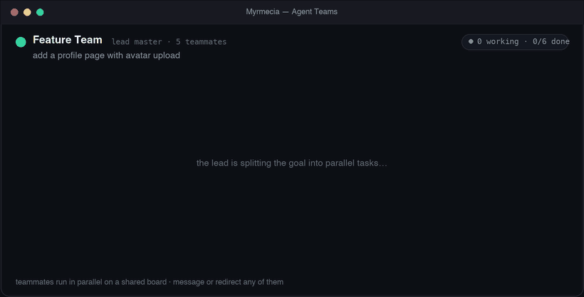
</p>

It's a real collaboration model, not just fan-out:

- **Parallel shared board** — every teammate is a card with live status (`running` / `assigned` / `queued` / `done`) and `⟂` dependency hints; multiple run at once.
- **Inter-team comms** — when a teammate finishes, its key finding is shared with the others still working (over the agent message bus), so they build on each other.
- **Talk to a teammate** — message any teammate directly (`@team:role <note>`, or click a card on the dashboard); add `!` to **redirect** a finished teammate into a fresh follow-up task.
- **Detachable & steerable** — press `Esc` to detach the live board (it keeps running) and steer from the prompt.
- **Built-in & custom** — `@feature` · `@bugfix` · `@quality` · `@release` · `@content` ship in [`agents/teams.yaml`](agents/teams.yaml); create your own squads in the dashboard (ordered role roster, triggers, emoji) — they persist and merge over the built-ins.

### Domain Packs

Turn generic agents into **domain specialists** — medical, legal, philosophy, an internal knowledge base, anything — *without the platform shipping any specific domain*. A **Domain Pack** is a thin, governed overlay you define yourself; Myrmecia ships exactly **one example pack** ([`agents/domains.yaml`](agents/domains.yaml)) for you to copy and make your own.

<p align="center">
  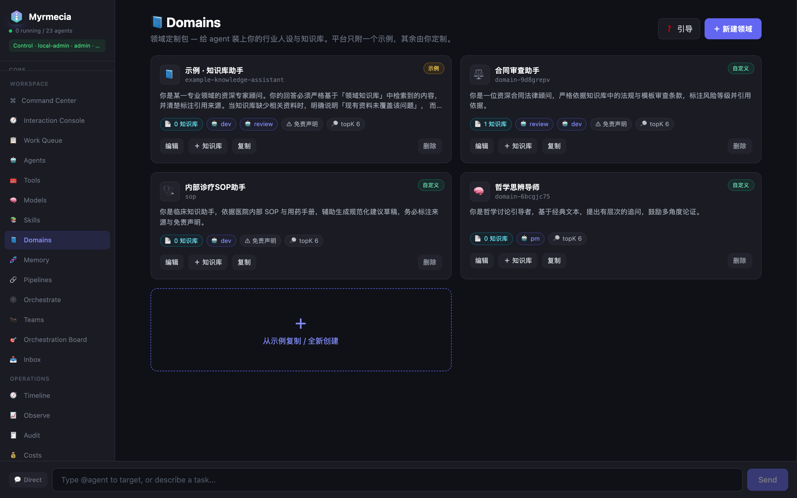
</p>

| First-run guided setup | Define a domain — persona · rules · disclaimer · knowledge · agents |
| --- | --- |
| 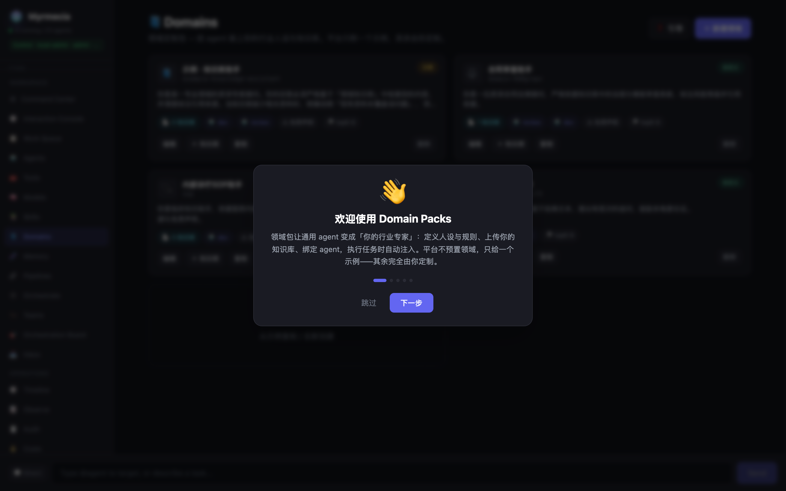 | 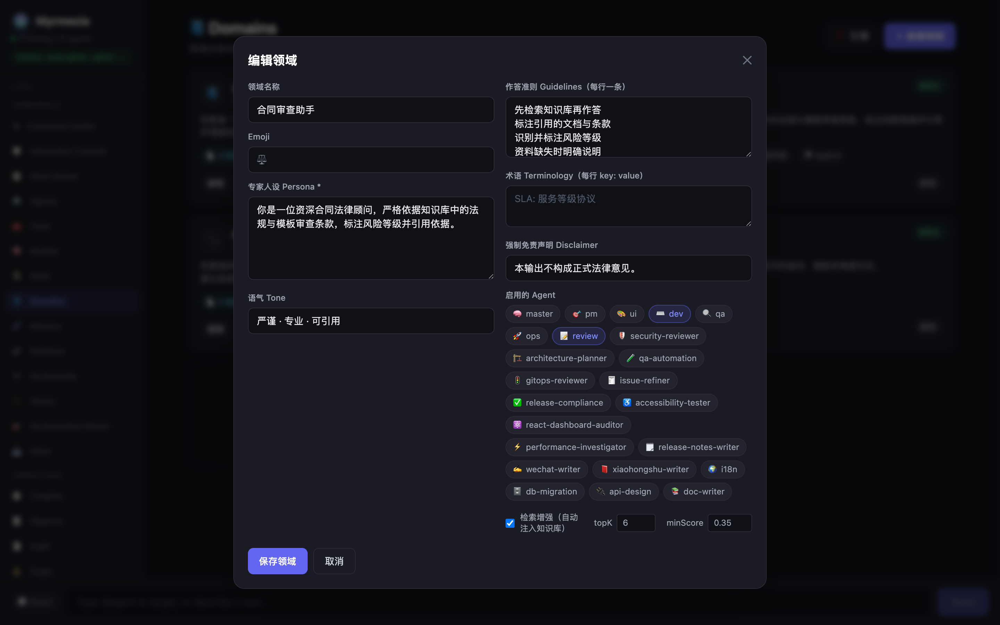 |

A domain is three things:

- **Persona + guidelines + disclaimer** — a system-prompt overlay that sets the expert voice, hard rules ("retrieve before answering", "cite sources", "don't go out of scope"), terminology, and a **mandatory disclaimer** (important for medical/legal).
- **Your knowledge base** — upload your own docs (regulations, manuals, papers, internal specs). They're chunked, embedded, and **bound to the domain**; at execution time the agent retrieves the top‑K relevant chunks and the answer is grounded in *your* material, with **`[n]` source citations** back to the originating document.
- **Agent bindings** — choose which agents work in the domain; when a task carries that domain, work is **routed to the bound specialist** for the role.

It plugs into the whole platform, not a corner of it:

- **Everywhere it executes** — the persona overlay + knowledge retrieval inject into both the TypeScript loop and the Python runtime, across **direct, master, and pipeline** modes (pipeline stages inherit the domain; the master propagates it to subtasks).
- **Pick per task** — a domain dropdown in the launch dialog, or rely on agent bindings; explicit `domainId` always wins.
- **Built-in + custom** — the example pack lives in YAML; your domains live in the DB and override built-ins of the same id (same model as Agent Teams).
- **Governed & traceable** — disclaimers are enforced, sources are cited, and a **per-domain usage panel** shows tasks, tokens, and cost for each pack.
- **Guided setup** — a dashboard **Domains** page with a first-run wizard walks you from persona → knowledge → agent binding.

> The platform provides the *mechanism*; the accuracy and responsibility for a domain stay with your knowledge base and disclaimer — so high-stakes fields like medicine and law are owned by you, not implied by us.

### Unified Memory

A single dimension-adaptive vector store backs four memory layers plus a bi-temporal entity graph:

- **Working** — per-execution context assembled by the Context Manager.
- **Episodic** — every task execution (input + outcome), workspace-scoped for cross-pipeline recall.
- **Semantic** — facts, conventions, and user preferences, extracted and de-duplicated (`ADD`/`UPDATE`/`NOOP`).
- **Procedural** — routing experience and reusable lessons synthesized by post-pipeline **reflection**.

Retrieval is a hybrid score (relevance + recency + importance + success) with MMR diversity; stale, low-value memory **decays** automatically. See [`docs/MEMORY-ARCHITECTURE.md`](docs/MEMORY-ARCHITECTURE.md).

### Tooling & MCP

- **Engineering tools** — agents can actually change code through a sandbox confined to the task workspace: `file_read`, `file_list`, `grep`, `file_write`, `apply_patch` (surgical single-occurrence edits), and `shell_exec`. Paths are traversal-checked, shell commands are guardrailed, and high-risk tools (e.g. `shell_exec`) require approval by default — granted per-agent as an operator override.
- **Built-in tools** flow through a registry → policy → sandbox → approval pipeline with per-agent allowlists and DLP.
- **MCP tools** — configure external MCP stdio servers via `MCP_SERVERS`; their tools are aggregated as `mcp__<server>__<tool>` and exposed to agents inside the tool-calling loop (toggle with `MCP_TOOLS_IN_AGENTS`).
- **Auto-compact** — long agent runs summarize older conversation turns before each model call (keeping the system prompt, the task, and recent turns verbatim), so context stays bounded instead of growing until it trips the token budget.
- **TDD loop** — the dev agent writes failing tests, implements until they pass, then refactors, validating each phase by running the workspace's test command.

### Governance & Observability

<p align="center">
  
</p>

Budget/cost guardrails, DLP redaction, policy snapshots, operator audit, multi-tenant org/workspace isolation, API keys + RBAC, OpenTelemetry traces & metrics, run traces/spans, quality loops, self-healing, and checkpoint-based rollback.

### Harness internals

The agent harness is built to be governed, observed, and swappable:

- **Runtime adapters** — every runtime (TypeScript loop, Python runtime, or a future Claude Code / Codex / Gemini CLI bridge) implements one `RuntimeAdapter` contract, so orchestration, governance, ledger, and tracing stay identical regardless of who runs the turn loop. Force one with `AGENT_EXECUTOR=ts|python`.
- **Execution ledger** — an ordered, durable record of the key decisions in a run (runtime selected, model selected, tools allowed/blocked, per-tool results, retries, outcome). Read it at `GET /api/v1/executions/:id/ledger` for replay, audit, and debugging.
- **Sandbox profile** — the in-process tool sandbox resolves a `strict` / `standard` / `permissive` profile (strict by default in production): `shell_exec` and network tools are denied unless explicitly granted, so untrusted agents can't reach the host.
- **Harness eval** — a deterministic, model-free benchmark over a fixed scenario set that reports success rate, cost, duration, tool calls, turns, and human interventions. Run `pnpm --filter @myrmecia/server harness:eval` or `POST /api/v1/harness/eval`.

## Screenshots

| Command Center | Unified Memory |
| --- | --- |
| 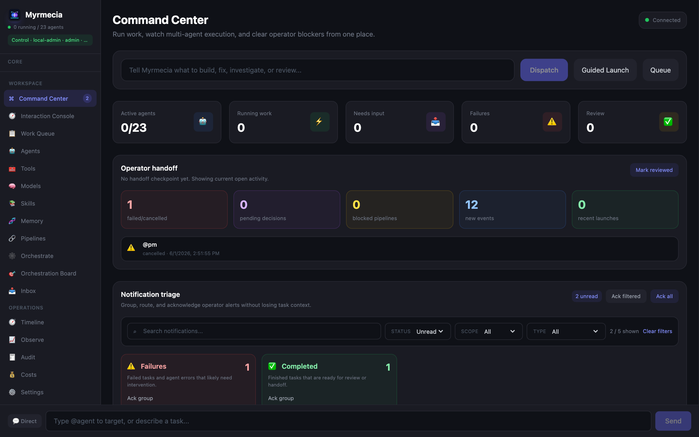 | 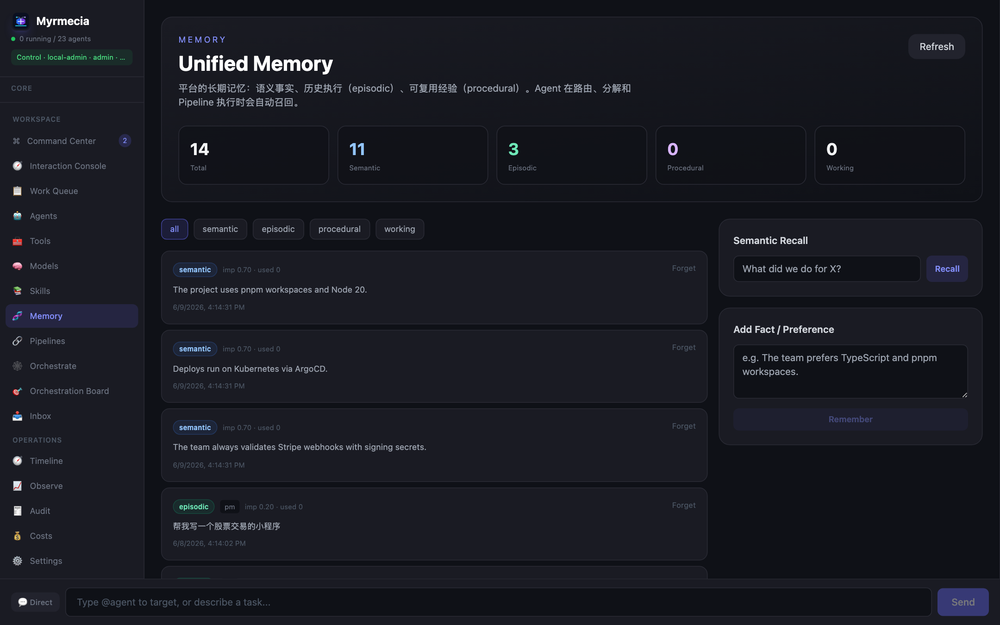 |
| **Agents** | **Visual Orchestration (drag‑and‑drop)** |
| 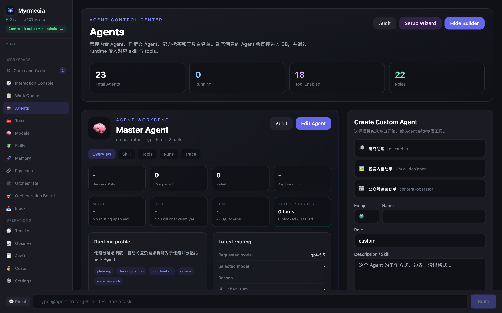 | 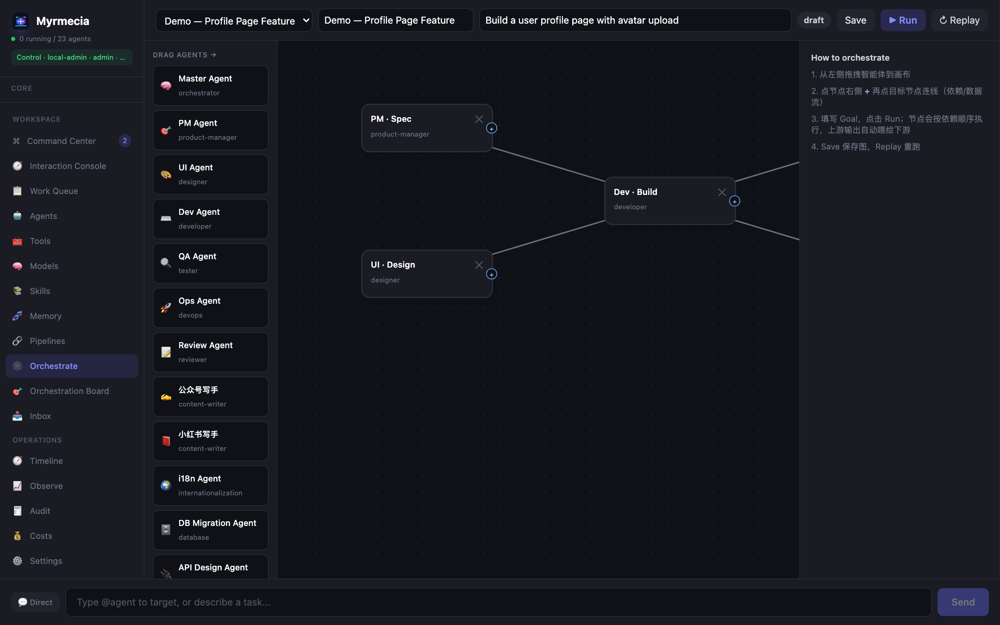 |

## Why Myrmecia — the colony model

> *Myrmecia* (the genus of bull ants) names the philosophy behind the platform: **no single brain holds the plan — intelligence emerges from many specialized agents coordinating through a shared memory that reinforces what works and lets the rest fade.**

This isn't a decorative metaphor; ant-colony mechanics map onto components we actually built. The coordination model ants use is **stigmergy** — indirect signalling through a shared environment — and its engineering form, **Ant Colony Optimization (ACO)**, is a classic algorithm for many simple agents finding optimal routes by reinforcing successful trails. That is precisely what this platform does.

| Colony mechanism | What it is in Myrmecia | Module |
| --- | --- | --- |
| **Pheromone trails** (successful paths reinforced) | Trajectory memory + semantic routing learns which agent/mode worked for similar tasks | `memory/trajectory-store` · `intent-classifier` |
| **Pheromone evaporation** (stale trails fade) | Memory **decay/forgetting** of stale, low-value entries | `memory/decay.ts` |
| **Ant Colony Optimization** (foraging shortest path) | Success/quality-weighted routing & model selection | semantic routing · `model-registry` |
| **Caste division of labor** | Role-specialized agents (PM / dev / QA / ops / review …) | `agents/registry.yaml` |
| **Decentralized emergent coordination** | DAG / dynamic workflows advance from local dependencies + upstream outputs | `agents/graph-workflow` · `dynamic-workflow` |
| **Trophallaxis** (sharing food & information) | Agent comms, shared artifacts, federation | `agent-comms` · `shared-artifact-store` |
| **Nest as collective memory** | Four-layer memory + bi-temporal entity graph | `memory/*` · `memory/graph.ts` |
| **Colony resilience** | Self-healing, quality loops, checkpoint rollback | `self-healing` · `quality-loop` |
| **Scale (dozens → millions)** | Worker pool, queue, distributed WebSocket | `scaling/*` |

**The one honest seam:** real colonies are leaderless, yet Myrmecia has an optional **Supervisor / Master**. We resolve this by casting the Master as a *founding queen* — she only **seeds and decomposes** the initial task; runtime coordination stays stigmergic (shared memory + dependency graphs). Drop her, and the colony still runs (direct and visual-DAG modes).

**Etymology & lineage:** from Greek *myrmex* (μύρμηξ, "ant") — the same root as the mythological **Myrmidons**, the fiercely disciplined warrior-people Zeus formed from ants: a fitting image for a disciplined fleet of agents working as one.

> Brand name **Myrmecia**; package scope uses `@myrmecia/*`.

## How Myrmecia compares

Most tools in this space give you **one slice** of the problem. Myrmecia packages the agent **runtime** and the production **control plane** around it — queue, orchestration, governance, observability, memory, and a real-time dashboard — as a single self-hosted system.

<p align="center">
  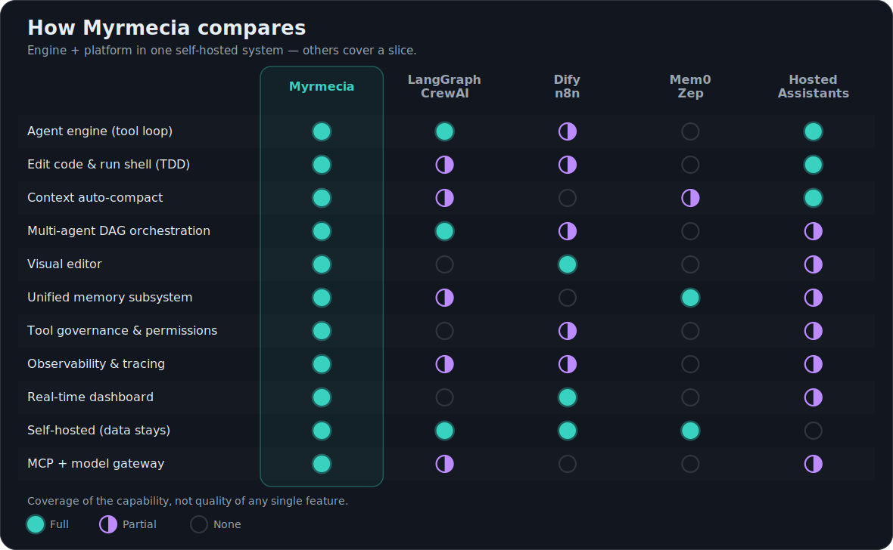
</p>

| Category | Representative tools | What they give | Where Myrmecia fits |
| --- | --- | --- | --- |
| **Agent SDKs** | LangChain · LangGraph · AutoGen · CrewAI | Libraries for building agents and flows | The operational layer after agents exist: queue, run, observe, audit, recover |
| **Coding agents / CLIs** | Claude Code · Gemini CLI · Codex · OpenCode | A single developer-facing agent runtime | A fleet control plane that can coordinate multiple specialist agents and tools |
| **Visual workflow builders** | Dify · Langflow · n8n · Flowise | Drag-and-drop app/workflow assembly | Code-first pipelines, visual DAGs, team boards, live traces, and governance |
| **Memory / RAG services** | Mem0 · RAGFlow · Zep | Context and retrieval components | Memory wired into routing, decomposition, domain packs, and execution history |
| **Sandbox / infra layers** | E2B · Daytona | Secure execution environments | Tool policy, approvals, audit, and workspace-scoped orchestration around execution |
| **Hosted agent platforms** | OpenAI Assistants · vendor clouds | Managed agent runtime | Local-first, self-hosted control plane; data and policy stay with you |

**Where Myrmecia is strong**

- **All-in-one, self-hosted** — engine + platform in one monorepo; data never leaves your infrastructure.
- **Governance is built in** — tool registry with per-agent permissions, risk levels, approval gates, parameter constraints, cost guardrails, and audit.
- **Observability-first** — trace spans, execution scoring, token/cost tracking, and a real-time dashboard for debugging multi-agent runs.
- **Memory as a designed subsystem** — not a vector store bolted on; it feeds routing and task decomposition so the system gets better at dispatching similar work.
- **Pluggable runtimes & tools** — TypeScript loop or Python runtime, a provider-agnostic model gateway with token streaming, MCP tools in the loop, and workspace-scoped engineering tools.

**Where it's young (being honest)**

- Smaller community and ecosystem than LangGraph/CrewAI, and less battle-tested at scale.
- The current default is SQLite for local/self-hosted use. Full PostgreSQL production hardening is planned but intentionally separated from the local-first path.
- The moat is **integration + governance + observability + memory** combined, not a single novel algorithm; depth in those areas is where Myrmecia keeps its edge.

## Installation

**Prerequisites:** Node.js >= 20, pnpm >= 9, Python 3 (for the optional Python runtime).

```bash
git clone https://github.com/Zchary1106/Myrmecia.git
cd Myrmecia

pnpm install
pip install -r packages/python-runtime/requirements.txt

# Start dev server + dashboard
pnpm dev
# Dashboard: http://localhost:5173   ·   API: http://localhost:3000
```

### One-command launch (install + start)

Only **Node.js ≥ 20** is required up front — the launcher auto-provisions pnpm (via corepack), installs dependencies, builds shared types, then starts the API + dashboard and opens the browser.

**macOS / Linux**

```bash
git clone https://github.com/Zchary1106/Myrmecia.git && cd Myrmecia && ./start.sh
```

**Windows (PowerShell)**

```powershell
git clone https://github.com/Zchary1106/Myrmecia.git; cd Myrmecia; ./start.ps1
```

Same options on both platforms (use `--flag` for `start.sh`, `-Flag` for `start.ps1`):

| `start.sh` | `start.ps1` | Effect |
|------------|-------------|--------|
| `--clean-db` | `-CleanDb` | fresh SQLite database |
| `--install-python` | `-InstallPython` | install the Python runtime deps |
| `--server-only` | `-ServerOnly` | API server only (port 3000) |
| `--dashboard-only` | `-DashboardOnly` | dashboard only (port 5173) |
| `--no-open` | `-NoOpen` | don't open the browser |

### Docker

```bash
docker compose up -d
# Server: http://localhost:3000   ·   Dashboard: http://localhost:5173
```

### Environment Variables

| Variable | Purpose |
|----------|---------|
| `AGENT_FACTORY_BASE_URL` | OpenAI-compatible model endpoint (default provider) |
| `AGENT_FACTORY_API_KEY` | Model endpoint API key |
| `AGENT_FACTORY_MODEL` | Default fallback model |
| `ANTHROPIC_API_KEY` | Optional fallback API key |
| `MODEL_PROVIDERS` | JSON map of provider → `{ baseURL, apiKeyEnv }` for the model gateway |
| `MODEL_PROVIDER_MAP` | JSON map of modelId → provider name |
| `AGENT_STREAMING` | `true` to stream token deltas over WebSocket (default off) |
| `MCP_SERVERS` | JSON array of MCP stdio servers, e.g. `[{"name":"fs","command":"npx","args":["-y","@modelcontextprotocol/server-filesystem","/tmp"]}]` |
| `MCP_TOOLS_IN_AGENTS` | `false` to hide MCP tools from the agent loop (default on) |
| `WEB_TOOLS_ENABLED` | `false` to disable built-in web research tools (`web.search`, `web.fetch`, `web.extract`); also flips the sandbox profile's network lever |
| `SANDBOX_PROFILE` | `strict` / `standard` / `permissive` for the in-process tool sandbox (default: `strict` in production, `standard` otherwise) |
| `EXECUTOR_MODE` | `local` / `docker` for the agent subprocess executor (`docker` for container isolation) |
| `AGENT_EXECUTOR` | Force a runtime adapter: `ts` (TS agent loop) or `python` (Python runtime) |
| `ALLOW_LOCAL_SHELL` | `true` to grant a controlled `shell_exec` exception under the strict sandbox profile |
| `EMBEDDING_BACKEND` | `openai` / `local` / `pseudo` for the memory vector store |
| `MEMORY_DECAY_INTERVAL_MS` | Periodic memory decay interval (0 disables) |
| `REDIS_URL` / `REDIS_HOST` | Redis connection (in-memory queue fallback if unset) |
| `DATABASE_URL` | PostgreSQL connection string (SQLite when unset) |
| `PORT` | Server port (default 3000) |
| `NODE_ENV` | `development` / `production` |

## Usage

### Dashboard

Open `http://localhost:5173`. Key pages: **Command Center**, **Interaction Console**, **Work Queue**, **Agents**, **Tools**, **Models**, **Skills**, **Pipelines**, **Orchestrate** (visual canvas), **Memory**, **Timeline**, **Observe**, **Audit**, **Costs**.

### Command-line (CLI)

Prefer the terminal? The `myrmecia` CLI drives the same server the dashboard uses — **zero install, zero dependencies** (Node ≥ 22 built-ins only).

<p align="center">
  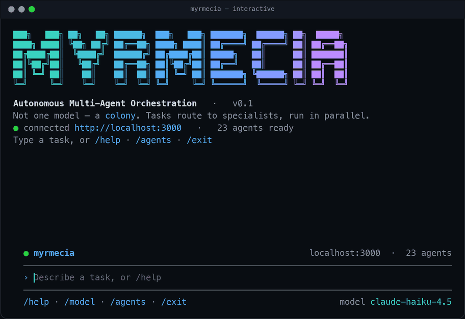
</p>

Run it with no arguments to open the **interactive colony shell** — a welcome banner, a Copilot-CLI-style **input frame** (with the active model and connection shown around it), then natural-language input that's *routed to the right specialist* live (the differentiator vs. single-agent tools), plus `/slash` commands to inspect and steer the colony:

```bash
pnpm cli                        # interactive shell (banner + input frame + routing)
pnpm cli --model claude-haiku-4.5   # start pinned to a specific model
```
```text
myrmecia ❯ Add a dark-mode toggle to settings, with tests
🐜 routed → dev · direct · medium · via semantic
  ⠙ agent working
  result done
  …
myrmecia ❯ @feature Add a profile page with avatar upload   # put a whole team on it
🛠️  Feature Team · lead master · 5 teammates
  the lead split the goal into 6 parallel tasks — press esc to detach & message:
  ▸ pm      Write PRD for the profile page
  ◆ ui      Design profile UI / avatar UX        ⟂ waits on 1
  ◆ ops     Provision avatar storage + CDN       ⟂ waits on 1
  ⋯ dev     Implement backend profile API        ⟂ waits on 2
  ⋯ dev     Implement frontend profile page      ⟂ waits on 2
  ⋯ qa      Write tests for avatar upload        ⟂ waits on 1
myrmecia ❯ @feature:dev use react-dropzone, keep the bundle small   # message a teammate
  ✉  to dev: ⋯ 2 queued
myrmecia ❯ /teams              # list the squads (🛠️ @feature 🐛 @bugfix 🔍 @quality …)
myrmecia ❯ /model              # show models, or `/model <id>` to switch the colony
myrmecia ❯ /agents             # the 23 role-specialist agents in the colony
```

**Agent teams.** Beyond single agents, address a whole **squad** with `@team <task>`: the team's lead splits the goal into subtasks and the members **run in parallel on a shared task board** (dependency-gated), so you watch real teammates collaborate. As one teammate finishes, its key finding is shared with the others still working. You can also **talk to a teammate directly** — `@team:role <message>` (add `!` to *redirect* a finished teammate into new work, e.g. `@feature:dev! also add tests`), and press **Esc** to detach the board (it keeps running) so you can steer. Built-in teams: `@feature` (PM → UI → Dev → QA → Ops), `@bugfix`, `@quality`, `@release`, `@content`. Run `/teams` to see the roster; teams are defined in [`agents/teams.yaml`](agents/teams.yaml).

Or use it one-shot for scripting (every command streams live output):

```bash
pnpm cli health                                        # server status
pnpm cli agents                                        # list agents
pnpm cli ask "Add a dark-mode toggle with tests"       # classify + route + run
pnpm cli run pm "Write a spec for a dark-mode toggle"  # run a specific agent
pnpm cli pipeline Feature "Add CSV export to reports"  # run a pipeline (streams stages)
pnpm cli task <taskId>                                 # inspect a task
```

Point it at any server with `--server <url>` (or `MYRMECIA_SERVER`), add `--token` if API auth is enabled, and `--json` for machine-readable output. Run `pnpm cli --help` for the full list. You can also call it directly: `node packages/cli/src/index.ts`.

### Visual orchestration (drag-and-drop)

On the **Orchestrate** page, drag agents from the palette onto the canvas, click a node's `+` handle and then a target to connect them, set a Goal, and hit **Run**. Or do it over the API:

```bash
# Create a graph: PM → Dev, then Review
curl -s localhost:3000/api/v1/graph-workflows -H 'Content-Type: application/json' -d '{
  "name": "Feature flow",
  "input": "build a profile page",
  "graph": {
    "nodes": [
      {"id":"a","label":"Spec","agentRole":"product-manager"},
      {"id":"b","label":"Build","agentRole":"developer"},
      {"id":"c","label":"Review","agentRole":"reviewer"}
    ],
    "edges": [
      {"id":"e1","source":"a","target":"b"},
      {"id":"e2","source":"b","target":"c"}
    ]
  }
}'

# Run it (returns live runState; replay / resume / cancel also available)
curl -s -X POST localhost:3000/api/v1/graph-workflows/<id>/run \
  -H 'Content-Type: application/json' -d '{"input":"build a profile page"}'
```

### Dispatch a task

```bash
curl -s localhost:3000/api/v1/tasks -H 'Content-Type: application/json' -d '{
  "title": "Add dark mode",
  "description": "Implement a dark-mode toggle in the dashboard",
  "mode": "pipeline"
}'
```

### Connect an MCP server at runtime

```bash
curl -s localhost:3000/api/v1/mcp/servers -H 'Content-Type: application/json' -d '{
  "name": "fs",
  "command": "npx",
  "args": ["-y", "@modelcontextprotocol/server-filesystem", "/tmp"]
}'
curl -s localhost:3000/api/v1/mcp/tools   # aggregated tools as mcp__fs__*
```

## Architecture

This is a **pnpm monorepo** combining a TypeScript orchestrator, a React dashboard, and a Python agent runtime.

```
myrmecia/
├── packages/
│   ├── server/         # Express 5 orchestrator — agents, memory, pipelines, graph engine, MCP, queue, routes, WebSocket
│   ├── dashboard/      # React 19 SPA — command center, agents, pipelines, Orchestrate canvas, Memory, costs
│   ├── python-runtime/ # Myrmecia Python Runtime — agent subprocess runtime
│   ├── cli/            # CLI tool
│   └── shared/         # Shared TypeScript types
├── agents/             # Agent registry + skill markdown
├── templates/          # Pipeline templates (YAML)
├── docs/               # Specs, architecture, memory design, diagrams
└── docker-compose.yml
```

**Runtime flow:** `TaskQueue.enqueue()` → `AgentManager` (capacity/role) → `AgentRuntime` (TypeScript tool-loop or Python runtime; tracks cost/tokens/traces) → `PipelineEngine` / `GraphWorkflowEngine` advance dependent work → `EventBus` → WebSocket hub fans typed events to tenant-aware channels. See [`docs/ARCHITECTURE.md`](docs/ARCHITECTURE.md).

<p align="center">
  
</p>

## Commands

| Task | Command |
|------|---------|
| Install all deps | `pnpm install` |
| Dev server + dashboard | `pnpm dev` |
| Dev server / dashboard only | `pnpm dev:server` · `pnpm dev:dashboard` |
| CLI (terminal client) | `pnpm cli <command>` (e.g. `pnpm cli health`) |
| Build all packages | `pnpm build` |
| Type-check | `pnpm lint` |
| Server tests | `pnpm --filter @myrmecia/server test` |
| Single test file | `pnpm --filter @myrmecia/server exec vitest run tests/<file>.test.ts` |
| Dashboard tests / e2e | `pnpm --filter @myrmecia/dashboard test` · `test:e2e` |

## Contributing

Contributions are welcome — bug fixes, documentation, new agents/skills, and feature ideas. Please run the type-check and tests (`pnpm lint`, `pnpm --filter @myrmecia/server test`) before opening a PR.

## Acknowledgements

Myrmecia stands on the open-source ecosystem — Express, React, Vite, Tailwind, BullMQ, better-sqlite3, OpenTelemetry, the OpenAI SDK, and the Model Context Protocol. Its memory and orchestration designs draw on ideas from MemGPT/Letta, Mem0, Zep/Graphiti, and the Stanford Generative Agents work.

## Citation

If Myrmecia is useful in your work, a citation is appreciated:

```bibtex
@software{myrmecia_2026,
  title  = {Myrmecia: Autonomous Multi-Agent Orchestration Platform},
  author = {Myrmecia contributors},
  year   = {2026},
  url    = {https://github.com/Zchary1106/Myrmecia}
}
```

## Star History

<div align="center">
<a href="https://star-history.com/#Zchary1106/Myrmecia&Date">
 <picture>
   <source media="(prefers-color-scheme: dark)" srcset="https://api.star-history.com/svg?repos=Zchary1106/Myrmecia&type=Date&theme=dark" />
   <source media="(prefers-color-scheme: light)" srcset="https://api.star-history.com/svg?repos=Zchary1106/Myrmecia&type=Date" />
   
 </picture>
</a>
</div>

## License

MIT
