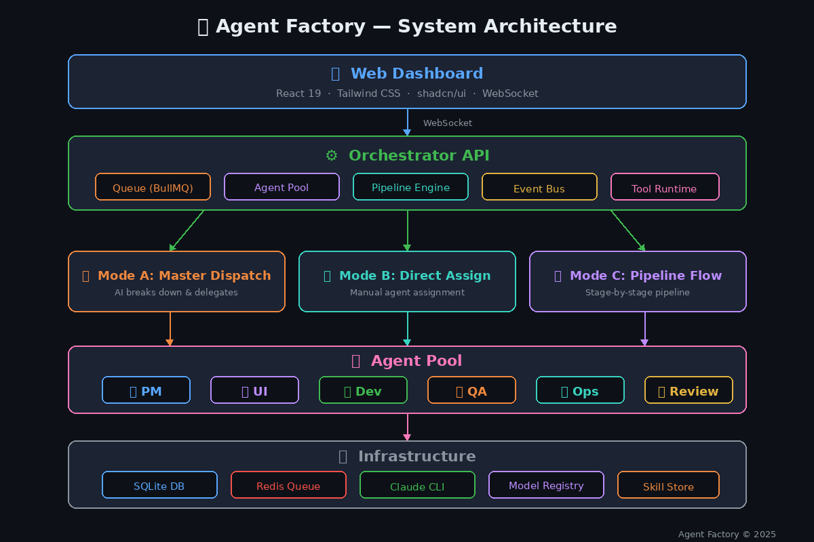

# Agent Factory

Autonomous multi-agent orchestration platform. Manage a pool of AI agents that execute tasks independently or in coordinated pipelines — from product spec to deployment.

## Architecture



Agent Factory is a **pnpm monorepo** that combines a TypeScript backend (Express 5), a React dashboard, and an Agent Factory Python runtime. Agents run in managed subprocesses, orchestrated through a BullMQ/Redis task queue, with real-time WebSocket events streamed to the dashboard.

| Layer | Main modules | Responsibility |
|-------|--------------|----------------|
| Frontend | `packages/dashboard` | React 19 dashboard for command center, agents, tasks, pipelines, skills, timeline, inbox, audit, and settings |
| API / Orchestrator | `packages/server/src/index.ts`, `routes/*` | Express API, auth/tenant middleware, REST resources, and WebSocket upgrade handling |
| Execution | `agents/agent-runtime.ts`, `agents/ts-agent-loop.ts`, `packages/python-runtime` | TypeScript agent loop plus optional Python runtime for tool-enabled agent execution |
| Planning | `agents/orchestrator.ts`, `agents/dynamic-workflow.ts`, `pipelines/pipeline-engine.ts` | Fixed templates, supervisor orchestration, and dynamic fan-out workflows |
| Queue | `queue/task-queue.ts` | BullMQ when Redis is configured; in-memory execution path for local/dev |
| Governance | `skills/tool-sandbox.ts`, `tools/tool-policy.ts`, `audit/execution-audit.ts`, `security/*` | Tool allowlists, guardian checks, DLP redaction/blocking, policy snapshots, audit reports |
| Persistence | SQLite schema in `packages/server/src/db/schema.sql` | Tasks, agents, executions, messages, pipelines, skills, tools, models, workflows, audit data |
| Real-time | `events/event-bus.ts`, `ws/ws-hub.ts` | Typed internal events mapped to tenant-aware WebSocket channels |

### Core runtime flow

1. A user creates a task, pipeline, or dynamic workflow through the dashboard/API.
2. Auth and tenant middleware resolve workspace access and API/token scope.
3. `TaskQueue` creates task rows and either enqueues BullMQ jobs or runs the in-memory path.
4. `AgentManager` selects an available agent by role/capacity.
5. `AgentRuntime` builds the prompt, selects a model, records a policy snapshot, and runs either the TypeScript loop or Python runtime.
6. Tool calls pass through registry policy, approval requirements, guardrails, sandbox checks, and DLP processing before results are returned.
7. Outputs, messages, model usage, traces, audit events, and workflow/pipeline artifacts are persisted and emitted to WebSocket subscribers.

For the full system design, data model, event map, and workflow diagrams, see [`docs/ARCHITECTURE.md`](docs/ARCHITECTURE.md).

## Quick Start

**Prerequisites:** Node.js >= 20, pnpm >= 9, Python 3 (for the optional Python runtime)

```bash
pnpm install
pip install -r packages/python-runtime/requirements.txt

# Start dev server + dashboard
pnpm dev

# Open dashboard
open http://localhost:5173
```

Startup options via `./start.sh`:

```bash
./start.sh --clean-db        # fresh SQLite database
./start.sh --install-python  # install Python runtime deps automatically
./start.sh --server-only     # API server only (port 3000)
./start.sh --dashboard-only  # dashboard only (port 5173)
```

Or via Docker:

```bash
docker compose up -d
# Server: http://localhost:3000
# Dashboard: http://localhost:5173
```

## Project Structure

```
agent-factory/
├── packages/
│   ├── server/       # Express 5 orchestrator — agents, pipelines, queue, routes, WebSocket
│   ├── dashboard/    # React 19 SPA — task/agent/pipeline monitoring, cost analytics
│   ├── python-runtime/ # Agent Factory Python Runtime — agent subprocess runtime
│   ├── cli/          # CLI tool for interacting with the platform
│   └── shared/       # TypeScript type definitions shared across packages
├── agents/           # Agent definitions (registry.yaml + 23 skill .md files)
├── templates/        # Pipeline templates (11 YAML workflow definitions)
├── docs/             # Design specs, architecture docs, diagrams
├── docker-compose.yml
└── Dockerfile
```

## How It Works

1. **Task Queue** — `TaskQueue.enqueue()` creates a task, emits `task:created`, and enqueues in BullMQ (or runs in-memory when Redis is unavailable).
2. **Agent Manager** — checks concurrent capacity, delegates to `AgentRuntime`.
3. **Agent Runtime** — runs the TypeScript loop or Agent Factory Python Runtime, tracks progress/cost/tokens, records trace spans, emits events.
4. **Pipeline Engine** — listens for `task:done`, writes stage artifacts, advances to the next ready stage(s). Supports parallel stages (`dependsOn`), manual gating, loop stages, and rollback.
5. **WebSocket Hub** — maps internal events to pub/sub channels (`tasks`, `task:{id}`, `agents`, `agent:{id}`, `pipelines`, `pipeline:{id}`, `executions`, `execution:{id}`).

## Features

### Agent Pool

23 specialized agents defined in `agents/registry.yaml`: Master, PM, UI Designer, Developer, QA, DevOps, Reviewer, Security Reviewer, API Designer, DB Migration, Doc Writer, i18n, Issue Refiner, Release Notes, Release Compliance, Performance Investigator, GitOps Reviewer, React Dashboard Auditor, Accessibility Tester, QA Automation, Architecture Planner, WeChat Writer, Xiaohongshu Writer.

Custom agents can be created from the dashboard or API. Each agent has configurable model, max turns, timeout, tool whitelist, and skill assignment.

### Agent Interaction Console

The dashboard includes an **Interaction Console** for making agent work easier to understand. It brings workflow/task structure, live agent messages, model routing, tool activity, audit events, and next-step recommendations into one view.

| Panel | Purpose |
| --- | --- |
| Workflow / task map | Select dynamic workflows or recent tasks and inspect task dependencies |
| Agent conversation | Read recent structured messages, tool uses, progress, and errors |
| Transparency panel | See selected agent, model/tier, route reason, tool status, audit blockers, and recommended next action |
| Control bar | Create dynamic workflows, retry/upgrade failed work, cancel tasks, and cancel active workflows |

This turns agent execution from a black box into an observable team workflow: who is acting, why they were selected, what evidence they produced, and what should happen next.

### Pipeline Workflows

11 pipeline templates for automated stage-by-stage execution:

| Template | Flow |
|----------|------|
| `full-product.yaml` | Spec → Design → Code → Test → Deploy |
| `bugfix.yaml` | Triage → Fix → Test → Deploy |
| `feature.yaml` | Spec → Code → Test → Review |
| `feature-with-qa-loop.yaml` | Feature with automated QA feedback loop |
| `product-quality.yaml` | Full product pipeline with quality gates |
| `parallel-feature.yaml` | Parallel stage execution via `dependsOn` |
| `qa-validation.yaml` | Dedicated QA validation workflow |
| `release-compliance.yaml` | Compliance-checked release process |
| `structured-autonomy.yaml` | Autonomous agent workflow with structured outputs |
| `wechat-article.yaml` | WeChat article generation pipeline |
| `xiaohongshu-note.yaml` | Xiaohongshu note generation pipeline |

Use the visual pipeline builder in the dashboard to create, edit, validate, and run custom templates.

### Dynamic Workflow Runtime

For large or ambiguous engineering requests, Agent Factory can now generate an executable workflow plan at runtime, fan out work across many specialized agents, and aggregate/validate the results. This is separate from fixed YAML templates: the runtime creates a `dynamic_workflows` run with step dependencies, dispatches each step as a task through the existing queue, tracks completion events, and emits a final validation summary.

API entry points:

| Endpoint | Purpose |
| --- | --- |
| `POST /api/v1/supervisor/workflows` | Create and dispatch a dynamic workflow from `{ goal }` or a supplied executable `{ plan }` |
| `GET /api/v1/supervisor/workflows` | List workflow runs |
| `GET /api/v1/supervisor/workflows/:id` | Inspect workflow plan, tasks, result, and validation summary |
| `POST /api/v1/supervisor/workflows/:id/cancel` | Cancel a workflow run |

### Agent Federation (Batch C)

Inter-agent communication protocol enabling agents to discover each other, share artifacts, and coordinate work. Includes capability registry, shared artifact store with access control, and sync/async messaging between agents.

### Skill Registry

Markdown-based skills with YAML frontmatter, versioned drafts/published states, assignment per agent, hot-reload via file watcher, and checksum-verified execution traces.

### Model Registry & Routing

Centralized model catalog with task-aware routing, per-agent defaults, role fallback, health badges, retry escalation, long-context routing, and automatic fallback chains through an OpenAI-compatible endpoint.

### Cost Dashboard

Real-time cost tracking with per-agent and per-model breakdowns, token usage charts, cost trend analysis, and summary cards.

### Execution Trace

Structured span inspection for prompt build, model selection, LLM calls, tool calls, and policy blocks. Full visibility into every agent execution.

### Tool Governance

Built-in tool runtime with enable/disable toggles, approval requirements, execution history, and per-agent tool whitelists. Blocks and approvals are recorded in the audit log.

### Quality & Governance

- **Self-healing** — automatic retry and recovery for failed executions
- **Quality loops** — feedback-driven improvement cycles
- **Execution scoring** — LLM judge evaluates output quality with sliding window averages
- **Coverage checking** — triggered on task completion
- **Pipeline rollback** — checkpoint-based stage rollback with retry
- **Operator audit** — all admin actions recorded

### Smart Notifications

WebSocket push notifications when tasks complete or require input. Optional WeCom integration.

## Environment Variables

| Variable | Purpose |
|----------|---------|
| `AGENT_FACTORY_BASE_URL` | OpenAI-compatible model endpoint |
| `AGENT_FACTORY_API_KEY` | Model endpoint API key |
| `AGENT_FACTORY_MODEL` | Default fallback model |
| `ANTHROPIC_API_KEY` | Optional fallback API key |
| `REDIS_URL` / `REDIS_HOST` | Redis connection (in-memory queue fallback if unset) |
| `DATABASE_URL` | PostgreSQL connection string (SQLite when unset) |
| `PORT` | Server port (default 3000) |
| `NODE_ENV` | `development` / `production` |

## Commands

| Task | Command |
|------|---------|
| Install all deps | `pnpm install` |
| Dev server + dashboard | `pnpm dev` |
| Dev server only | `pnpm dev:server` |
| Dev dashboard only | `pnpm dev:dashboard` |
| Build all packages | `pnpm build` |
| Type-check | `pnpm lint` |
| Server tests | `pnpm --filter @agent-factory/server test` |
| Single test file | `pnpm --filter @agent-factory/server exec vitest run tests/<file>.test.ts` |
| Dashboard tests | `pnpm --filter @agent-factory/dashboard test` |
| Dashboard e2e | `pnpm --filter @agent-factory/dashboard test:e2e` |

## License

MIT
