# Agent Factory Architecture

Agent Factory 是一个面向“多 Agent 协作生产”的本地优先编排平台。它把 Agent 定义、任务队列、Pipeline、实时事件、Human-in-the-loop、工具能力和 Dashboard 管理放在同一个系统里，支持从产品需求、设计、开发、测试、部署到内容创作的端到端工作流。

## 1. System Context

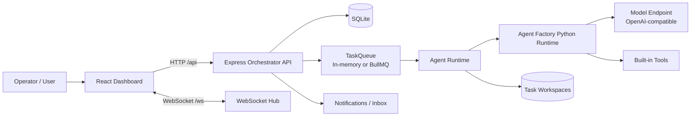

### Responsibilities

| Layer | Responsibility |
| --- | --- |
| Dashboard | Agent 管理、任务发起、Pipeline 控制、实时状态、Inbox、观测和设置 |
| Express API | REST API、鉴权、任务/Agent/Pipeline/模板/系统路由 |
| TaskQueue | 任务入队、优先级、Redis/BullMQ 或本地内存执行路径 |
| Agent Runtime | 创建 execution、组装 skill prompt、运行 TS loop 或 Python Runtime、记录消息/成本/状态 |
| Model Router | 选择实际模型、应用 role/global fallback、记录健康状态和使用量 |
| Python Runtime | 根据 Agent 配置构建运行时 Agent，调用模型与工具 |
| SQLite | Agent 定义、任务、执行记录、消息、Pipeline、通知、审计事件 |
| WebSocket Hub | 把内部事件广播到 Dashboard 对应 channel |

### Module Map

| Area | Primary files | Notes |
| --- | --- | --- |
| Startup wiring | `packages/server/src/index.ts` | Initializes telemetry, DB, registries, task queue, pipeline engine, dynamic/supervisor routes, WebSocket hub, and background services |
| Agent registry | `agents/registry.yaml`, `agents/*.md`, `agents/agent-manager.ts` | Registry YAML defines default agents; markdown files define prompt/skill behavior; DB rows are the runtime source |
| Runtime execution | `agents/agent-runtime.ts`, `agents/ts-agent-loop.ts`, `packages/python-runtime/runtime_runner.py` | Runs tasks, emits events, records traces, applies DLP, tracks cost/tokens, and enforces runtime budgets |
| Dynamic workflow | `agents/dynamic-workflow.ts`, `routes/supervisor.ts` | Generates executable plans, dispatches fan-out tasks, watches task events, validates and summarizes runs |
| Pipeline engine | `pipelines/pipeline-engine.ts`, `templates/*.yaml` | Fixed workflow templates with stage dependencies, artifacts, manual gates, QA loops, and rollback |
| Model routing | `models/model-registry.ts`, `models/smart-router.ts` | Task-aware routing, fallback groups, retry escalation, long-context selection, health/usage tracking |
| Tool governance | `tools/tool-policy.ts`, `skills/tool-sandbox.ts`, `skills/tool-guardian.ts` | Tool enablement, approval gates, high-risk metadata, command blocking, secret/unsafe input checks |
| Audit and security | `audit/execution-audit.ts`, `auth/*`, `security/*` | API auth, tenant scoping, DLP rules, policy snapshots, audit reports, event recording |
| Dashboard state | `packages/dashboard/src/stores/store.ts`, `packages/dashboard/src/lib/api.ts` | Zustand state, REST client, WebSocket updates, preview-friendly fallback loaders |

## 2. High-level Runtime Architecture

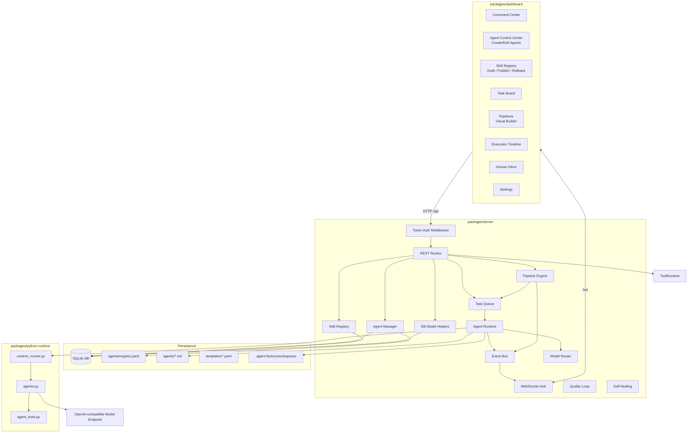

## 3. Agent Model

Agent 在系统里是 **capability template**，不是常驻 worker。它描述“这个角色如何工作、能用什么工具、适合哪些任务、默认模型是什么”。实际执行状态放在 `task_executions`、`execution_messages` 和 `run_traces` 中。

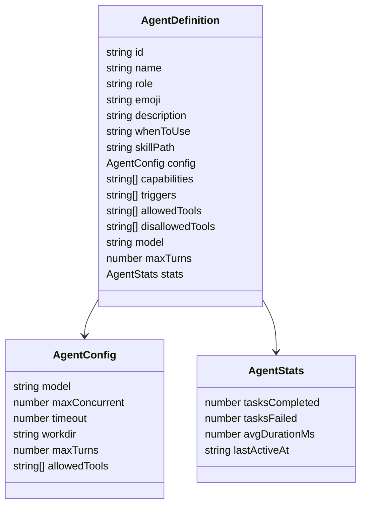

### Agent Sources

| Source | Purpose |
| --- | --- |
| `agents/registry.yaml` | 预置 Agent 列表、默认 role/model/tools/capabilities |
| `agents/*.md` | 预置 Agent 的主 skill prompt |
| Dashboard Create/Edit | 动态 Agent 或运行时 skill overlay、工具白名单、模型配置 |
| SQLite `agents` | 最终运行时读取的 Agent 定义源 |

启动时 `AgentManager.initializeFromRegistry()` 会读取 `agents/registry.yaml`。如果 Agent 不存在，会插入 DB；如果已存在，会刷新 registry 中的描述、skill path、capabilities、triggers、allowed tools 和默认模型配置。

## 4. Agent Execution Flow

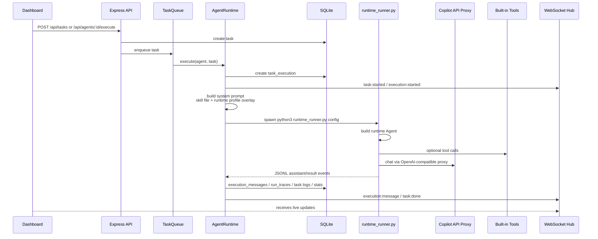

### Prompt Composition

Runtime prompt is composed as:

```text
agents/<agent>.md

## Runtime Profile Override
You are <name>, a <role> agent.
Mission: <dashboard description>
When to use: <whenToUse>
Capabilities: ...
Allowed tools: ...
```

This keeps file-based skills versionable while allowing Dashboard edits to take effect immediately.

## 5. Tools and Skills Architecture

Tools are governed by a server-side Tool Runtime and implemented in `packages/python-runtime/agent_tools.py`. An Agent can request tools through `allowedTools`, but the server filters that list through the tool catalog, enabled flags, per-Agent permissions, disallowed tools, and approval requirements before passing tools to execution.

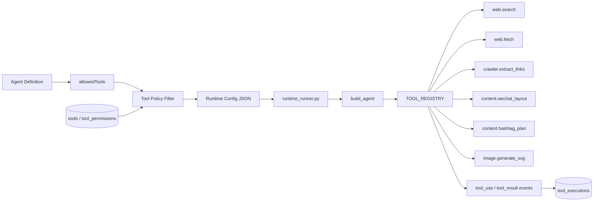

## 5.1 Dynamic Workflow Runtime

Dynamic workflows are generated at runtime instead of loaded from a fixed YAML template. The runtime creates an executable plan, fans steps out through the normal `TaskQueue`, and listens for task terminal events to validate and summarize the run.


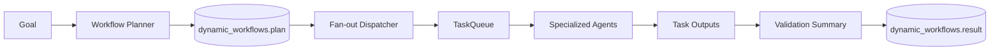

Each plan contains `steps[]` with `id`, `agentRole`, `input`, and `dependsOn`. The dispatcher converts step dependencies into task dependencies, so independent steps can run in parallel while QA/security/release gates wait for upstream outputs.

### Dynamic workflow lifecycle

| Phase | Status | What happens |
| --- | --- | --- |
| Create | `planning` | API accepts `{ goal }` or an executable `{ plan }`; the planner creates/validates steps and dependencies |
| Dispatch | `dispatching` | Each step is assigned to an available agent role and persisted as a normal task |
| Run | `running` | Existing queue/runtime executes sub-tasks; events include `workflow:task_dispatched`, `workflow:task_completed`, and `workflow:task_failed` |
| Validate | `validating` | When all child tasks reach terminal state, required steps are checked and outputs are aggregated |
| Finish | `done` / `failed` / `cancelled` | Result and validation summary are persisted in `dynamic_workflows` |

Dynamic workflows intentionally reuse the normal task/execution path instead of creating a second worker system. This means model routing, DLP, tool governance, audit snapshots, workspace scoping, task logs, execution timeline, and WebSocket delivery all remain consistent.

### Dynamic workflow API

| Endpoint | Behavior |
| --- | --- |
| `POST /api/v1/supervisor/workflows` | Create a workflow from `{ goal }` or dispatch a supplied `DynamicWorkflowPlan` |
| `GET /api/v1/supervisor/workflows` | List workflow runs, optionally scoped by workspace |
| `GET /api/v1/supervisor/workflows/:id` | Return workflow run plus child tasks |
| `POST /api/v1/supervisor/workflows/:id/cancel` | Mark a workflow cancelled |

The current planner is deterministic and rule-based. It can be replaced or augmented later by an LLM planner that produces the same validated `DynamicWorkflowPlan` shape.

`/api/tools` exposes the catalog, policy updates, per-Agent permissions, and execution history. The Dashboard **Tools** page shows enabled status, approval requirement, risk level, and recent tool calls.

Skills are governed through a server-side Skill Registry. Startup imports `agents/*.md` as published versions, and Agent execution resolves the prompt from an explicit `skill_assignments` row before falling back to the Agent `skillPath`.

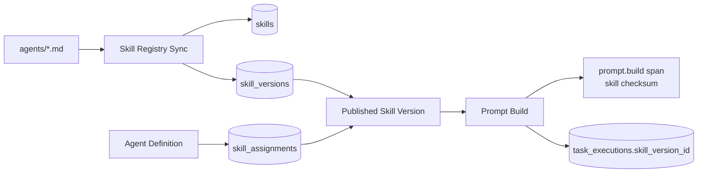

The Dashboard **Skills** page supports draft creation, published-version immutability, markdown preview, line diff against the current published version, and per-Agent assignment/rollback to any published version.

### Built-in Tools

| Tool | Capability |
| --- | --- |
| `web.search` | DuckDuckGo HTML 搜索，返回标题和链接 |
| `web.fetch` | 抓取 http/https 页面文本，做事实查证和资料整理 |
| `crawler.extract_links` | 从页面提取可见链接，适合资料索引/轻量爬虫 |
| `content.wechat_layout` | 把公众号 Markdown 草稿转成移动端友好的 HTML blocks |
| `content.hashtag_plan` | 生成中文关键词、标签和搜索意图 |
| `image.generate_svg` | 本地生成 SVG 封面草稿到 `generated-assets/cover.svg` |

### Recommended Tool Mapping

| Agent | Recommended tools |
| --- | --- |
| PM / Master / Review | `web.search`, `web.fetch` |
| Dev / API / DB / Ops | `web.search`, `web.fetch` |
| Doc Writer | `web.search`, `web.fetch`, `crawler.extract_links` |
| WeChat Writer | `web.search`, `web.fetch`, `crawler.extract_links`, `content.wechat_layout`, `content.hashtag_plan`, `image.generate_svg` |
| Xiaohongshu Writer | `web.search`, `web.fetch`, `content.hashtag_plan`, `image.generate_svg` |
| UI Agent | `image.generate_svg` |
| i18n / QA | lightweight fetch/search as needed |

## 6. Model Registry and Routing

The model selector is backed by the server-side Model Registry and constrained to models exposed through the configured OpenAI-compatible endpoint. Agent Factory uses the endpoint's native model IDs, such as `gpt-5.4-mini` and `claude-haiku-4.5`.

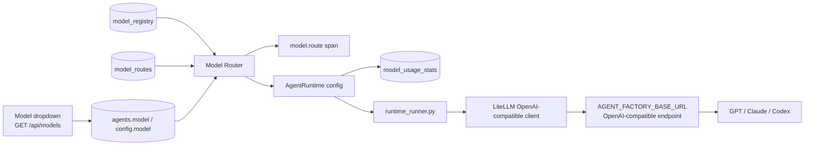

Routing order:

1. **Task route** from goal/input/profile, prompt size, and retry count:
   - simple summaries/docs/triage -> cheap route
   - code/fix/refactor/API/DB -> `gpt-5.3-codex`
   - explicit security/tenant/DLP/sandbox/release-risk reviews -> strong route
   - long prompt/context -> `gpt-5.4`
   - repeated failures -> balanced, then strong
2. Explicit enabled `agent.model`.
3. Explicit enabled `agent.config.model` / `modelPolicy.preferredModel`.
4. `modelPolicy.fallbackModel` or `modelPolicy.tier`.
5. Enabled `role:<agent.role>` route.
6. Enabled `global` route.
7. Highest-priority enabled model in the requested fallback group.
8. `AGENT_FACTORY_MODEL` as the final runtime fallback.

Each execution writes a `model.route` trace span and a `model_usage_stats` row with selected model, tokens/cost when available, latency, and route reason. `/api/models` exposes the catalog, enabled flags, health checks, and route updates; model config changes are audited as `model.update` / `model.route.update`.

### Model routing examples

| Task profile | Selected model | Why |
| --- | --- | --- |
| "summarize release notes" | `gpt-5.4-mini` | cheap default for small low-risk text tasks |
| "fix TypeScript API bug" | `gpt-5.3-codex` | coding route |
| "security review tenant isolation" | `gpt-5.5` | explicit high-risk review route |
| "analyze entire repository" | `gpt-5.4` | long-context route |
| cheap task failed once | `gpt-5.4` | retry escalation to balanced |
| task failed repeatedly | `gpt-5.5` | retry escalation to strong |

### Supported Model Options

| Model ID | Best for |
| --- | --- |
| `gpt-5.5` | Strong reasoning, orchestration, security, architecture |
| `gpt-5.4` | Long-context fallback and large analysis |
| `gpt-5.3-codex` | Coding and refactoring |
| `gpt-5.4-mini` | Default low-cost model for simple tasks |
| `claude-opus-4.8` | Strong fallback for review/planning |
| `claude-opus-4.7` | Strong Claude fallback |
| `claude-haiku-4.5` | Fast/low-cost summaries, docs, i18n |
| `gemini-3.1-pro-preview` | Multimodal or web-heavy analysis |
| `gemini-3-flash-preview` | Lightweight multimodal fallback |

Environment variables:

```bash
AGENT_FACTORY_BASE_URL=https://your-model-endpoint.example.com/v1
AGENT_FACTORY_API_KEY=...
AGENT_FACTORY_MODEL=gpt-5.4-mini
```

Per-agent model config takes precedence when the selected model is enabled in the registry; disabled models are skipped and routed through the configured role/global fallback.

## 7. Task and Pipeline Flow

### Direct Task

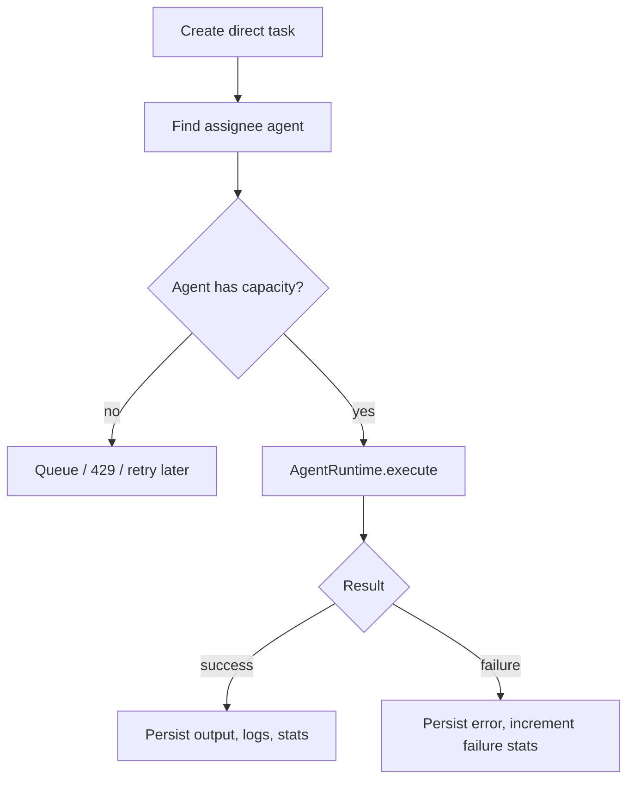

### Pipeline Task

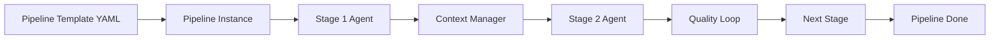

Pipeline templates live in `templates/*.yaml`, for example:

| Template | Stages |
| --- | --- |
| `full-product` | PM → UI → Dev → QA → Ops |
| `feature` | Spec → Code → Test → Review |
| `bugfix` | Triage → Fix → Test |
| `wechat-article` | 选题 → 写作 → 审核 → 排版 |
| `xiaohongshu-note` | 选题 → 创作 → SEO |

## 8. Dashboard Architecture

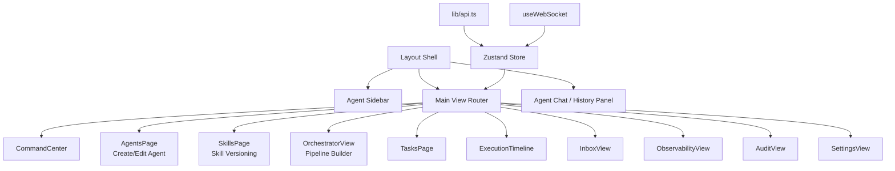

### Agent Control Center

The Agents page supports:

- Search by name, role, capability, or tool.
- Filter by role.
- View capabilities and enabled tools on each Agent card.
- Create custom Agents from templates.
- Edit existing Agents.
- Update skill overlay, capabilities, triggers, model, max turns, timeout, and allowed tools.
- Open Skill Registry to draft/publish prompt versions and assign or roll back a specific Agent.

### Visual Pipeline Builder

The Pipelines view includes a lightweight visual builder:

- Stage list with add/remove/reorder controls.
- Per-stage config panel for name, Agent role, and prompt template.
- Flow preview for the full stage sequence.
- Auto/manual gate mode selection.
- Template validation through `/api/templates/validate`.
- Save/update template and immediate `POST /api/pipelines` run.

Template mutations are audited as `template.create` and `template.update`.

## 9. Permission and Audit

Operator identity is resolved from proxy headers, API token, or local mode:

```text
X-Operator-Id / X-Operator-Role -> proxy actor
Authorization: Bearer ...       -> token-admin
local dev without auth          -> local-admin
```

Roles:

| Role | Behavior |
| --- | --- |
| `admin` | Full launch, runtime, config, and destructive controls |
| `operator` | Runtime launch/control and Agent/Tool configuration |
| `viewer` | Read-only access; write/control routes return `403 OPERATOR_FORBIDDEN` |

Audit records are persisted in `operator_actions`. Current audited controls include task create/cancel/retry/delete, pipeline create/approve/skip/cancel, inbox response, workspace preference restore, Agent create/update/execute, Tool policy/permission updates, Model route/policy updates, Skill create/version/publish/assignment updates, and Template create/update.

## 10. Database Design

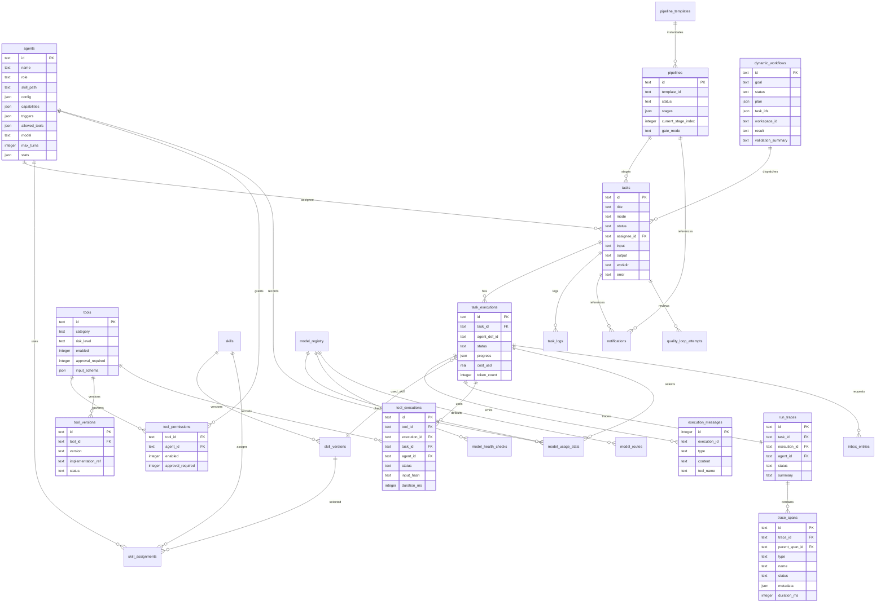

Default database path:

```text
packages/server/data/agent-factory.db
```

Override with:

```bash
DB_PATH=/tmp/agent-factory-clean.db pnpm dev
```

## 11. Events and Real-time Updates

The server emits typed domain events through `eventBus`. `WSHub` maps them to channels so the Dashboard can update only relevant views.

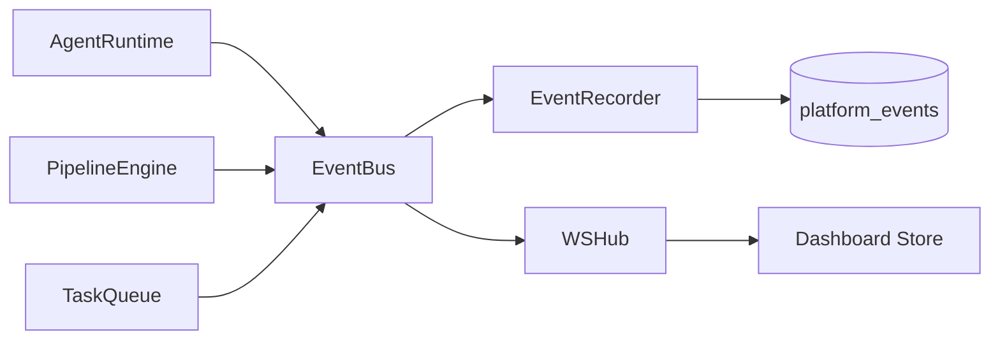

Typical events:

| Domain | Events |
| --- | --- |
| Task | `task:created`, `task:started`, `task:done`, `task:failed` |
| Execution | `execution:started`, `execution:message`, `execution:done`, `execution:failed` |
| Pipeline | stage start/done, blocked, done, failed |
| Workflow | `workflow:created`, `workflow:planned`, `workflow:task_dispatched`, `workflow:task_completed`, `workflow:done`, `workflow:failed` |
| Agent | registry/status related updates |

## 12. Deployment View

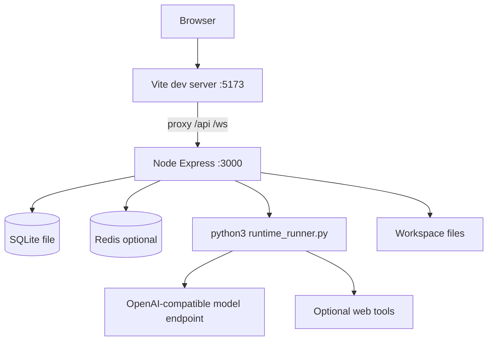

Local startup:

```bash
pnpm install
pnpm dev
```

Separated startup:

```bash
pnpm dev:server
pnpm dev:dashboard
```

## 13. Reliability and Recovery

| Mechanism | Design |
| --- | --- |
| In-memory fallback queue | If Redis is absent, `TaskQueue` executes through local memory path |
| Recovery on startup | Recover running tasks, interrupted pipelines, and quality-loop attempts |
| Workspace isolation | Task outputs are written under task workspaces |
| Execution messages | Runtime activity is persisted for timeline/history views |
| Operator controls | Cancel/retry/delete/pipeline controls are recorded and role-gated |
| Human inbox | Approval/question/input/review entries persist operator decisions |
| Runtime budgets | Max turns, output length, token budget, tool-call count, cumulative tool runtime, and wall-clock limits |
| Model fallback | Task route fallback group, role/global routes, retry escalation, and final env fallback |

## 13.1 Security and Governance Boundaries

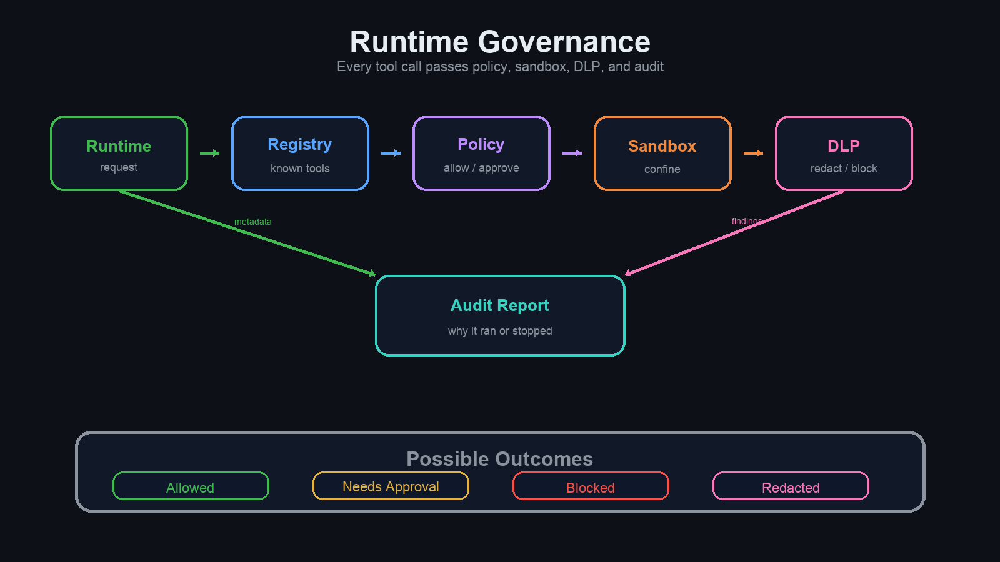

| Boundary | Enforcement |
| --- | --- |
| API auth | Static admin token and API key auth with route scope checks |
| Tenant/workspace | Request workspace context gates REST routes, WebSocket subscriptions, and audit/workflow access |
| Tool policy | Tool catalog must be enabled, allowed by agent, not approval-required, and pass metadata checks |
| Tool guardian | Blocks pipe-to-shell, destructive git, unsafe SQL, obvious exfiltration, high-confidence secrets, and unsafe package installs |
| DLP | Agent output, tool output, cached output, and Python runtime stdout/stderr pass through DLP redaction/blocking |
| Runtime isolation | Python runtime has resource/output limits; production local executor can be blocked unless explicitly allowed |
| Auditability | Execution policy snapshots capture model route, tool policy, runtime limits, workspace scope, DLP mode, and blocked events |

## 14. Current Limits and Extension Points

| Area | Current design | Extension |
| --- | --- | --- |
| Tools | Built-in Agent Factory Python tools | Add provider-backed image generation, browser automation, MCP tools |
| Model list | Static dashboard dropdown | Fetch model list from the configured OpenAI-compatible endpoint if available |
| Agent skills | Markdown + dashboard overlay | Versioned skill registry and diff/rollback |
| Queue | Redis optional, memory fallback | Distributed workers and per-Agent concurrency pools |
| Dashboard editing | Agent create/edit supported | Full diff view, dry-run prompt preview, tool permission templates |
| Content tools | WeChat layout + SVG cover | Real WeChat editor export, image model generation, media library |
