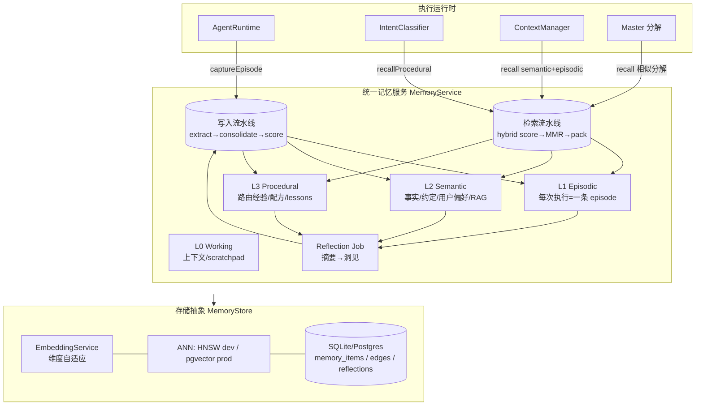
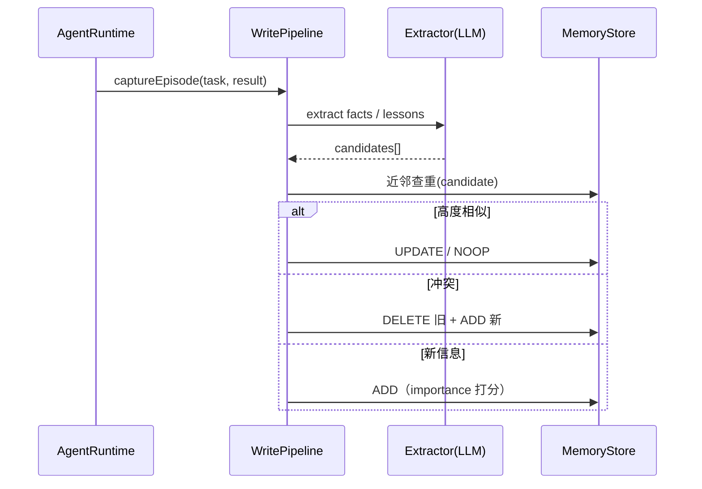
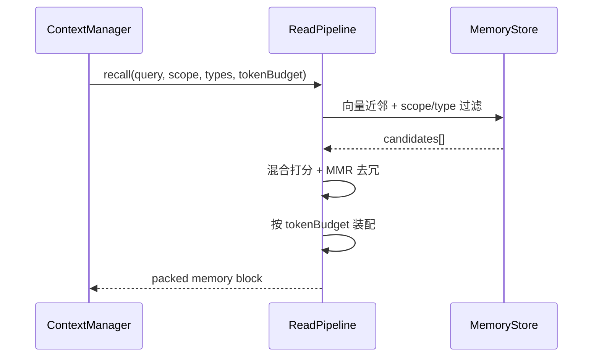

# Agent Factory Memory Architecture（统一记忆系统设计）

> Status: **P1–P5 已落地**
> Scope: `packages/server` 记忆子系统的统一重构与演进
> Related: [`ARCHITECTURE.md`](./ARCHITECTURE.md) · [`SUPERVISOR-MODE.md`](./SUPERVISOR-MODE.md)

> **实现状态（P1–P5 全部完成）**
> - **P1 统一底座**：`memory/types.ts`、`memory/memory-store.ts`（`memory_items/memory_edges/reflections` + 维度自适应 HNSW + 混合打分 + MMR）、`memory/trajectory-store.ts`（适配器 + 迁移）、`knowledge/pgvector-store.ts`（维度自适应）。
> - **P2 召回注入 + API + 面板**：`memory/memory-service.ts`（token 预算 context block + captureEpisode + remember）、`pipelines/context-manager.ts` 注入长期记忆、`agents/agent-runtime.ts` 捕获 episode、`routes/memory.ts`（`/api/v1/memory/*`）、Dashboard `pages/Memory.tsx`。
> - **P3 写入流水线**：`memory/write-pipeline.ts`（extract → consolidate `ADD/UPDATE/NOOP` → score），任务成功后抽取语义事实/偏好。
> - **P4 反思 + 衰减**：`memory/reflection.ts`（pipeline 完成→insights + procedural lesson）、`memory/decay.ts`（TTL 过期 + 陈旧情景遗忘），启动时执行一次 decay。
> - **P5 双时态实体图**：`memory/graph.ts`（实体/关系抽取、`valid_from/valid_to` 双时态边、supersede、图增强检索）。
> - **测试**：`tests/memory-store.test.ts`、`memory-p2/p3/p4/p5.test.ts`（共 ~27 项，全绿）。下文「9. 分阶段落地」标注进度。

本文档盘点 Agent Factory 现有的记忆相关实现，对比市面主流 Agent Memory 方案，并提出一套**分层、统一、可渐进落地**的记忆架构。目标是让平台具备**跨任务/跨会话学习能力**：记住项目约定、用户偏好、历史经验，并在路由、分解、Pipeline 执行时自动召回。

---

## 1. 现状盘点（What we already have）

记忆能力目前分散在 `memory/` 与 `knowledge/` 两处，缺少统一抽象。

| 模块 | 文件 | 作用 | 记忆类型 |
|---|---|---|---|
| Embedding 服务 | `memory/embedding.ts` | OpenAI / 本地 MiniLM / pseudo 三后端 + LRU 缓存 | 基础设施 |
| ANN 索引 | `memory/hnsw.ts` | 纯 TS 的 HNSW 近邻索引，可序列化进 SQLite BLOB | 基础设施 |
| 轨迹存储 | `memory/trajectory-store.ts` | 每次任务执行→轨迹 `(taskInput + agent + mode + success + quality)`，语义路由 `recommendRoute()` | **程序性记忆**雏形 |
| RAG | `knowledge/rag.ts` | 文档 `chunk → embed → search`；`agent_memories` KV 表 | **语义记忆** + 简易 KV |
| 向量库 | `knowledge/pgvector-store.ts` | 生产向量持久化（pgvector + HNSW 索引） | 基础设施 |
| 上下文压缩 | `pipelines/context-manager.ts` | 前序 stage 摘要、直接前驱全量注入 | **工作记忆** |
| 原始日志 | DB: `execution_messages` / `agent_messages` / `task_logs` | 对话轮次、Agent 间交接、任务日志 | **情景记忆**原料（未结构化） |

**运行时接入现状**

- `agent-runtime.ts` → 任务完成/失败后 `recordTrajectory()` 写入轨迹（fire-and-forget）。
- `intent-classifier.ts` → `recommendRoute()` 做语义路由（confidence > 0.75 时采用）。
- `context-manager.ts` → 仅压缩本 Pipeline 内的 stage 产物，**不读取长期记忆**。

---

## 2. 关键差距（Gaps）

1. **碎片化 / 双轨制**：存在两条 embedding 调用路径与两个向量存储（内存 HNSW vs pgvector），没有统一 `MemoryStore` 接口。
2. **维度不一致风险**：`pgvector-store.ts` 硬编码 `vector(1536)`，一旦 `EMBEDDING_BACKEND=local(384)` 或 `pseudo(256)`，与 HNSW/pgvector 维度不匹配会导致写入或检索失败。
3. **`agent_memories` 仅 KV**：不可语义检索（必须已知 key），无重要性/衰减/来源追踪。
4. **缺少反思 / 巩固（Reflection / Consolidation）**：任务完成后不抽取"经验教训"，无法把琐碎执行沉淀为可复用知识。
5. **缺少记忆分型与统一作用域**：`workspace / user / agent / session / pipeline` 标注不一致（RAG 有 workspace，trajectory 是全局）。
6. **缺少写入/检索策略**：没有去重、冲突合并、重要性打分、遗忘衰减、token 预算装配。
7. **长期记忆未注入执行**：`context-manager` 与 master 分解都拿不到历史语义/情景/程序性记忆。
8. **无时序/实体知识**：跨任务的事实（"X 服务用 Redis 队列"）没有结构化存储与时间有效性。

---

## 3. 市场主流机制调研（Research synthesis）

| 系统 | 核心机制 | 可借鉴点 |
|---|---|---|
| **MemGPT / Letta** | 分层记忆：*core*（在上下文、可自编辑的 memory block）+ *recall*（历史）+ *archival*（向量库），靠工具调用在层间"分页"换入换出 | 分层 + 自编辑 memory block + token 预算驱动的换页 |
| **Mem0** | 生产级记忆层，写入流水线 `extract → consolidate(ADD/UPDATE/DELETE/NOOP) → score → vector store` | **去重与冲突合并**的写入流水线 |
| **Stanford Generative Agents** | memory stream + 检索打分 `score = α·relevance + β·recency + γ·importance`，定期 **reflection** 合成高层洞见 | 三因子检索打分 + 反思巩固 |
| **Zep / Graphiti** | **双时态知识图谱**（valid-time + transaction-time），实体/关系节点，向量 + 图混合检索，支持"时光回溯" | 双时态 + 实体图（可选高级层） |

**结论**：业界共识是把记忆分成 *working / episodic / semantic / procedural* 四类，配合 **写入流水线（抽取-去重-打分）** 与 **检索流水线（混合打分-去冗-装配）**，并用 **反思** 做长期巩固。我们的 `trajectory-store` ≈ procedural 雏形，`rag` ≈ semantic 雏形，已经走在正确方向，缺的是**统一抽象 + episodic + 反思 + 策略层**。

---

## 4. 提议架构（Proposed architecture）

### 4.1 四层记忆模型（贴合"任务/Pipeline"领域）



| 层 | 内容 | 来源 | 消费方 |
|---|---|---|---|
| **L0 Working** | 单次执行的上下文、scratchpad、Pipeline stage 摘要 | `context-manager`（扩展） | 当前执行 |
| **L1 Episodic** | 每次任务执行=一条 episode：`input / plan / 关键步骤 / 产物 / 结果`。泛化现有 trajectory | `agent-runtime` 捕获 | 路由、分解、context 注入 |
| **L2 Semantic** | 事实与知识：项目约定、技术决策、用户偏好、RAG 文档、（可选）实体图 | 写入流水线抽取 + 文档导入 | context 注入、问答 |
| **L3 Procedural** | "怎么做 X"：路由经验、可复用配方、Reflexion 式经验教训 | trajectory + 反思 | `intent-classifier`、master |

### 4.2 横切能力

- **统一 Scope/命名空间**：每条记忆打标 `org / workspace / user / agent / session / pipeline`，检索按需过滤与降权。
- **统一存储接口**：一个 `EmbeddingService`（维度由后端动态决定）+ 一个 `MemoryStore` 抽象（dev=HNSW、prod=pgvector），消除双轨。
- **写入流水线（借鉴 Mem0）**：
  `capture → LLM extract（抽取候选事实）→ dedup/consolidate（ADD/UPDATE/DELETE/NOOP）→ importance 打分 → 持久化`。
- **检索流水线（借鉴 Generative Agents）**：
  `retrieve(query, scope, types) → 混合打分 → MMR 去冗 → 按 token 预算装配进 prompt`。
- **反思（Reflection）**：Pipeline / episode 结束后异步 `summarize → insights`，沉淀为 L3 lessons 与 L2 facts。
- **衰减 / 遗忘**：`effective = importance × exp(-Δt/τ)`，低分归档，ephemeral 设 `expires_at` TTL。

### 4.3 检索打分公式

```
score = w_r · cosine(query, item)
      + w_t · exp(-Δt / τ)            # recency 衰减
      + w_i · importance              # 0..1
      + w_s · success_quality         # episodic/procedural 的历史成功率
```

- 先按 `scope` + `type` 过滤，再算 `score`，最后 **MMR** 做多样性去冗。
- 默认权重（可调）：`w_r=0.55, w_t=0.15, w_i=0.2, w_s=0.1`，`τ≈14d`。

---

## 5. 统一数据模型（Data model）

```sql
-- 统一记忆条目（取代/合并 task_trajectories + agent_memories）
CREATE TABLE IF NOT EXISTS memory_items (
  id              TEXT PRIMARY KEY,
  type            TEXT NOT NULL CHECK(type IN ('working','episodic','semantic','procedural','entity')),
  -- 作用域（NULL 表示全局/不限定）
  scope_org       TEXT,
  scope_workspace TEXT,
  scope_user      TEXT,
  scope_agent     TEXT,
  scope_session   TEXT,
  scope_pipeline  TEXT,
  -- 内容
  content         TEXT NOT NULL,
  summary         TEXT,
  embedding       BLOB,                 -- Float32Array；维度记录于 metadata
  -- 打分
  importance      REAL NOT NULL DEFAULT 0.5,
  success         REAL,                 -- episodic/procedural
  quality         REAL,
  -- 来源追踪
  source_type     TEXT,                 -- task|pipeline|document|reflection|user
  source_id       TEXT,
  -- 生命周期 / 双时态
  created_at      DATETIME DEFAULT CURRENT_TIMESTAMP,
  last_accessed_at DATETIME,
  access_count    INTEGER NOT NULL DEFAULT 0,
  valid_from      DATETIME,
  valid_to        DATETIME,
  expires_at      DATETIME,
  metadata        JSON NOT NULL DEFAULT '{}'
);
CREATE INDEX IF NOT EXISTS idx_mem_type      ON memory_items(type);
CREATE INDEX IF NOT EXISTS idx_mem_workspace ON memory_items(scope_workspace);
CREATE INDEX IF NOT EXISTS idx_mem_agent     ON memory_items(scope_agent);
CREATE INDEX IF NOT EXISTS idx_mem_source    ON memory_items(source_type, source_id);

-- 实体/关系图（Graphiti 式双时态，P5）
CREATE TABLE IF NOT EXISTS memory_edges (
  src_id     TEXT NOT NULL,
  dst_id     TEXT NOT NULL,
  relation   TEXT NOT NULL,
  weight     REAL NOT NULL DEFAULT 1.0,
  valid_from DATETIME DEFAULT CURRENT_TIMESTAMP,  -- valid time 起
  valid_to   DATETIME,                            -- valid time 止（NULL=当前有效）
  created_at DATETIME DEFAULT CURRENT_TIMESTAMP,  -- transaction time
  PRIMARY KEY (src_id, dst_id, relation)
);

-- 反思产物
CREATE TABLE IF NOT EXISTS reflections (
  id                TEXT PRIMARY KEY,
  scope_workspace   TEXT,
  scope_pipeline    TEXT,
  summary           TEXT NOT NULL,
  insights          JSON NOT NULL DEFAULT '[]',
  source_episode_ids JSON NOT NULL DEFAULT '[]',
  created_at        DATETIME DEFAULT CURRENT_TIMESTAMP
);
```

**迁移策略**：`task_trajectories` 迁移为 `memory_items(type IN ('episodic','procedural'))`；`agent_memories` 迁移为 `type='semantic'`（保留 KV 兼容视图）。复用现有 `hnsw_indexes` 表做持久化。

---

## 6. 写入 / 检索流水线（Pipelines）





---

## 7. 接入点（Integration points）

| 现有代码 | 改动 | 状态 |
|---|---|---|
| `agents/agent-runtime.ts` `recordTrajectory()` | `captureEpisode` + 写入流水线 `ingestFromExecution` | ✅ |
| `agents/intent-classifier.ts` `recommendRoute()` | 程序性记忆路由（trajectory adapter） | ✅ |
| `pipelines/context-manager.ts` | `buildStageInputWithMemory` 注入 `recall(semantic+episodic+procedural)` | ✅ |
| `agents/master-agent.ts`（任务分解） | 召回相似历史 lesson/episode 作为 few-shot | ✅ |
| `pipelines/pipeline-engine.ts` | `pipeline:done` → `reflectOnPipeline` | ✅ |
| `knowledge/rag.ts` | 文档 chunk 桥接进统一记忆（`type='semantic'`, `source_type='document'`，复用 embedding） | ✅ |
| `index.ts` | 启动初始化 + 周期 decay 调度（`MEMORY_DECAY_INTERVAL_MS`） | ✅ |
| `routes/memory.ts` | `/api/v1/memory/*`（list/stats/recall/add/delete/reflections/decay/graph） | ✅ |
| `dashboard` | Memory 面板（浏览/语义检索/新增/遗忘） | ✅ |

> RAG 桥接采用「双写」策略：保留既有知识库检索路径不变，同时把文档 chunk 写入统一记忆以参与召回/上下文注入；检索路径的彻底合并留待后续。

---

## 8. 配置（Config）

```bash
MEMORY_BACKEND=hnsw|pgvector          # 默认随 NODE_ENV
EMBEDDING_BACKEND=openai|local|pseudo # 维度自动适配（1536/384/256）
MEMORY_SCORE_W_RELEVANCE=0.55
MEMORY_SCORE_W_RECENCY=0.15
MEMORY_SCORE_W_IMPORTANCE=0.2
MEMORY_SCORE_W_SUCCESS=0.1
MEMORY_RECENCY_TAU_DAYS=14
MEMORY_RECALL_TOKEN_BUDGET=1500
MEMORY_REFLECTION_ENABLED=true
```

> **务必**先解决维度不一致：`pgvector` 的 `vector(1536)` 需改为按 `EmbeddingService.dimensions` 动态建表，否则非 OpenAI 后端会失败。

---

## 9. 分阶段落地（Rollout）

| 阶段 | 范围 | 风险 | 状态 |
|---|---|---|---|
| **P1** | 统一 `MemoryStore` 接口 + 维度自适应 + `memory_items` schema + 迁移 trajectory | 低（重构，行为不变） | ✅ 已完成 |
| **P2** | Episodic 捕获 + 检索注入 `context-manager` + `/api/v1/memory/*` + dashboard 面板 | 中 | ✅ 已完成 |
| **P3** | 写入流水线（extract / consolidate / score）做语义事实 + 用户偏好 | 中 | ✅ 已完成 |
| **P4** | Reflection + procedural lessons + 衰减遗忘 | 中 | ✅ 已完成 |
| **P5** | Graphiti 式双时态实体图 | 高 | ✅ 已完成 |

> 注：实体节点使用独立的 `entity` 记忆类型，避免污染语义事实的检索/计数；浏览列表与 Agent 召回默认不包含 `entity`。

---

## 10. 待评审的开放问题（Open questions）

1. **抽取用哪个模型**：写入流水线的 extract 用便宜模型（`gpt-5.4-mini`）还是规则优先 + LLM 兜底？
2. **作用域默认值**：用户偏好默认挂 `scope_user` 还是 `scope_workspace`？跨 workspace 是否共享 procedural 经验？
3. **隐私 / 多租户**：记忆是否需要按 org 强隔离 + 加密？`forget` 是否要硬删 + 审计（呼应 `audit/`）。
4. **反思触发时机**：按 Pipeline 完成触发，还是按 episode 数量阈值（Generative Agents 式）？
5. **图层取舍**：P5 实体图是自建 `memory_edges` 还是直接接 Graphiti/Zep 外部服务？

---

## 附录：术语对照

| 英文 | 中文 | 在本系统的对应 |
|---|---|---|
| Working memory | 工作记忆 | `context-manager` 注入的上下文 |
| Episodic memory | 情景记忆 | 任务执行 episode（泛化 trajectory） |
| Semantic memory | 语义记忆 | 事实/约定/偏好 + RAG 文档 |
| Procedural memory | 程序性记忆 | 路由经验 + 配方 + lessons |
| Reflection | 反思巩固 | `reflections` 表 + 异步 job |
| Consolidation | 去重合并 | 写入流水线 ADD/UPDATE/DELETE/NOOP |
