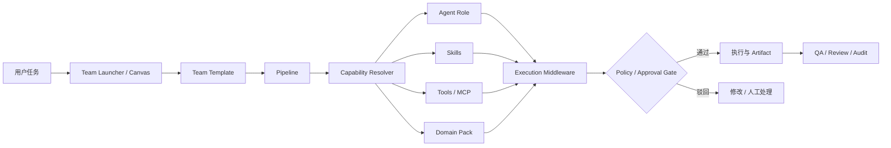

# Myrmecia Agent / Skill / Domain / Team 重构方案

> 状态：Phase 0–5 完成（T1～T24）+ T24 延续收尾完成（legacy 默认隐藏、Studio 入口 Team 化）  
> 更新日期：2026-08-16  
> 目标读者：接手实现的开发 Agent、架构负责人、QA  
> 范围：Agent Directory、Skill、Tool、Domain Pack、Team、Canvas、Pipeline Runtime 及现有内容工作流迁移

## 0. 实施状态总览

| Phase | 任务 | 状态 |
|---|---|---|
| Phase 0 基线与架构冻结 | T1～T4 | ✅ 完成（2026-08-16） |
| Phase 1 兼容层与运行时 | T5～T8 | ✅ 完成（2026-08-16） |
| Phase 2 Registry 与 Skills 迁移 | T9～T12 | ✅ 完成（2026-08-16） |
| Phase 3 Domain 与 Team 产品化 | T13～T15 | ✅ 完成（2026-08-16） |
| Phase 4 UI 与交互 | T16～T18 | ✅ 完成（2026-08-16） |
| Phase 5 验证、迁移与发布 | T19～T24 | ✅ 完成（2026-08-16） |

Phase 0–5 交付物（详见 §8.1 实施记录）：

- `docs/architecture/refactor/object-model.md`（T1）
- `docs/architecture/refactor/reference-scan.md`（T2）
- `docs/architecture/refactor/compatibility-and-rollback.md`（T4）
- Contract v2 类型与验证器（T3）：`packages/shared/src/contracts.ts`、`packages/server/src/contracts/team-composer-contracts.ts`
- Legacy Alias（T5）：`agents/legacy-agent-aliases.yaml`、`packages/server/src/agents/legacy-agent-alias-resolver.ts`
- Capability Resolver（T6）：`packages/server/src/agents/capability-resolver.ts`
- Execution Plan Snapshot（T7）：`packages/server/src/agents/execution-plan-snapshot.ts`
- Team Preflight（T8）：`packages/server/src/agents/team-preflight.ts`
- 通用角色（T9）：`agents/registry.yaml` 新增 `researcher` / `content-creator` + `agents/researcher.md`、`agents/content-creator.md`
- Skills 迁移（T10/T11）：`agents/skills/<skill-id>/SKILL.md`（23 个）+ Skill 同步支持多目录
- Registry 清理机制（T12）：`/api/agents` 支持 `MYRMECIA_HIDE_LEGACY_AGENTS` flag
- Domain Pack 产品化（T13）：`packages/server/src/routes/domains.ts`（`/domains/:id/copy`、`/domains/:id/test`、`/domains/:id/version`）；`packages/server/src/agents/domain-registry.ts`（`copyDomain` / `bumpDomainVersion` / `findDomainReferences` / `DomainInUseError`）；DB 迁移 `202608160001_domain_pack_versioning`
- Team v2 CRUD（T14）：`packages/server/src/routes/teams.ts`（v2 schema + `GET /teams/:id/preflight`）；`packages/server/src/agents/team-registry.ts`（`roles` / `policy` / `domainIds` / `contractVersion`）；DB 迁移 `202608160002_team_definitions_v2`
- 内容 Team 迁移（T15）：`agents/teams.yaml` 中 content / xiaohongshu / douyin / social-three-lanes 四个 Team 升级 Contract v2，保留原 `members` 兼容
- Agent Directory / Detail（T16）：`packages/dashboard/src/pages/Agents.tsx`（稳定角色 + Legacy aliases 折叠区 + 所属 Teams）、`packages/dashboard/src/components/agents/AgentCard.tsx`、`AgentWorkbench.tsx`
- Teams 页面与 Canvas（T17）：`packages/dashboard/src/pages/Teams.tsx`（v2 角色槽位展示/编辑、Preflight 面板、复制并定制、在 Canvas 打开）、`packages/dashboard/src/lib/api.ts`（Team v2 DTO + `/teams/:id/preflight`）
- Content Studio 解耦（T18）：`packages/dashboard/src/components/agents/contentStudioProfiles.ts`（Team 驱动配置）、`ContentStudio.tsx`（按 Team 切换、无 Agent ID 条件分支）、`AgentWorkspace.tsx`
- Dashboard 测试（T19/T20）：`tests/components.test.tsx` 适配 + 新增 profile 匹配用例（73 用例）；`e2e/refactor-phase5.spec.ts`（Team v2 Preflight / Legacy aliases / Studio Team 切换）
- 迁移 dry-run（T21）：`packages/server/scripts/refactor-migration-dry-run.mjs`（只读扫描，输出影响报告）
- 升级指南（T23）：`docs/architecture/refactor/migration-guide.md`
- Feature Flag（T24）：启动接入 `MYRMECIA_PREFLIGHT_ENFORCE`（v2 Team 启动前强制 Preflight）

## 1. 背景与结论

Myrmecia 已经具备 Agent Registry、Skills、Tools、Domain、Team、Pipeline、Canvas 和运行时编排等基础能力，但当前产品仍同时存在两套心智模型：

1. **旧模型**：每一种业务能力都定义为一个 Agent，例如“小红书写手”“公众号写手”“数据库迁移 Agent”。
2. **目标模型**：Agent 是稳定的执行角色，业务能力由 Skill 提供，行业上下文由 Domain Pack 提供，外部操作由 Tool 提供，Team 和 Pipeline 负责组合与执行。

Team Composer 的 Contract、Runtime 和 UI 已经落地，但 Agent Registry 和 Agent Directory 尚未完成迁移，因此用户仍然看到大量平台型、任务型 Agent。这不是单纯的页面展示问题，而是对象边界、运行时解析、模板兼容和配置交互尚未统一。

本轮重构的最终目标是：

> 用户选择一个 Team 或在 Canvas 中组建团队；系统根据 Pipeline 节点，为稳定角色挂载所需 Skills、Tools 和 Domain Pack，并经过统一的权限、合规、人工审批和 Artifact Gate 后执行。

---

## 2. 当前实现与主要问题

### 2.1 已具备的能力

- `agents/registry.yaml` 已能注册 Agent、能力和 Skill 引用。
- `agents/teams.yaml` 已提供 Feature、Bugfix、小红书、抖音、公众号和三平台等团队。
- `agents/domains.yaml` 已提供 Domain Pack 格式及一个 starter 示例。
- Team Composer 已具备 Contract、运行时和 Canvas UI。
- Skills、Tools、Artifacts、Domains、Teams 已有独立导航入口。
- 内容工作台已支持小红书、抖音、公众号工作流的创建和阶段展示。

### 2.2 当前不一致

| 问题 | 当前表现 | 影响 |
|---|---|---|
| Agent 与 Skill 边界模糊 | 小红书写手、公众号写手、API Design、DB Migration 都是 Agent | Agent 数量持续膨胀，复用困难 |
| Team 只组合 Agent | Team 成员主要通过 Agent role 表达，不能完整表达 Skill、Tool、Domain | Team 无法真正成为能力组合器 |
| Agent Directory 仍是旧入口 | 页面集中展示 34 个 Agent，并按 Core/Content/Specialists 分组 | 用户误以为必须先选择具体业务 Agent |
| 内容 UI 硬编码 Agent ID | Content Studio 根据固定 writer ID 切换流程 | 新增平台必须改 UI 代码 |
| Domain Pack 尚未产品化 | 只有示例 Domain，绑定和版本体验不完整 | 领域知识无法稳定复用和审计 |
| 旧工作流存在强耦合 | Pipeline、历史记录和前端可能依赖旧 Agent ID | 直接删除 Agent 会破坏已有数据 |
| 能力解析不完整 | Runtime 未形成 Team → Role → Skill → Tool → Domain 的统一解析链 | 配置存在但执行不一定真正采用 |

### 2.3 本次不做的事情

- 不删除历史执行记录。
- 不在没有兼容层的情况下直接删除旧 Agent ID。
- 不将所有专业角色一次性合并成一个“万能 Agent”。
- 不把 Skill 当作可直接执行、可持有身份的 Agent。
- 不让 Domain Pack 直接拥有外部副作用权限。

---

## 3. 目标对象模型

### 3.1 对象职责

| 对象 | 定义 | 应包含 | 不应包含 |
|---|---|---|---|
| Agent | 稳定的执行角色和责任主体 | persona、职责、模型策略、默认权限、可用能力范围 | 具体平台模板、一次性任务流程 |
| Skill | 可复用的工作方法与专业能力 | instructions、输入输出、约束、评测、版本 | 密钥、登录状态、直接副作用权限 |
| Tool | 对文件、浏览器、API、MCP 等外部系统的操作接口 | schema、权限、风险等级、超时、审计 | 业务人设和长篇方法论 |
| Domain Pack | 领域知识、术语、规则和检索配置 | persona overlay、guidelines、knowledge IDs、disclaimer | 团队成员和执行顺序 |
| Team | 可复用的协作配置 | lead、roles、skills、tools、domain、coordination、policy | 具体运行实例状态 |
| Pipeline | 有依赖关系的执行过程 | nodes、inputs、outputs、gates、retries、artifacts | 固定页面逻辑 |
| Gate | 运行时控制点 | 自动检查、人工审批、阻断条件、审计记录 | 内容生成职责 |

### 3.2 目标关系



### 3.3 设计原则

1. **Agent 少而稳定**：按责任划分，不按平台名称划分。
2. **Skill 可组合**：一个 Agent 可在不同 Team 中挂载不同 Skill。
3. **Tool 最小权限**：生成内容和发布内容必须是两种不同权限。
4. **Domain 可替换**：同一个 Team 应能切换不同领域知识包。
5. **Pipeline 数据驱动**：前端不能通过 Agent ID 硬编码工作流。
6. **兼容优先**：迁移期间旧 ID、历史运行和模板继续可读。
7. **显式 Gate**：发布、写文件、推送代码等高风险动作必须可审计。
8. **Artifact First**：每个阶段都应输出可预览、可修改、可追踪的产物。

---

## 4. Agent 与 Skill 迁移建议

### 4.1 第一阶段保留的稳定 Agent

为降低迁移风险，第一阶段先保留以下稳定角色：

- `master`：编排和决策。
- `pm`：需求、范围和验收。
- `ui`：交互与视觉设计。
- `dev`：工程实现。
- `qa`：验证和质量保证。
- `review`：独立审查。
- `ops`：外部执行、发布、部署和恢复。
- `architecture-planner`：复杂系统设计，可后续评估是否合并为 Skill。
- `security-reviewer`：承担独立安全责任，暂不合并。
- `researcher`：新增通用研究角色，承接趋势和资料调研。
- `content-creator`：新增通用内容创作角色，承接多平台创作。

### 4.2 迁移矩阵

| 当前 Agent | 目标归属 | 新 Skill / Gate | 兼容策略 |
|---|---|---|---|
| `wechat-writer` | `content-creator` | `wechat-longform-writing`、`wechat-html-layout` | 旧 ID alias 到角色 + Skills |
| `xiaohongshu-writer` | `content-creator` | `xiaohongshu-copywriting`、`hashtag-planning` | 保留 alias 和旧路由 |
| `xiaohongshu-visual-designer` | `ui` | `xiaohongshu-card-design`、`social-image-generation` | 旧 ID 映射到 `ui` |
| `douyin-writer` | `content-creator` | `douyin-hook-script`、`shot-list-design` | 保留旧流程入口 |
| `trend-scout` | `researcher` | `social-trend-evidence`、`competitive-research` | 旧 ID 映射到 researcher |
| `content-strategist` | `pm` 或 `content-creator` | `content-core-planning`、`cross-platform-adaptation` | 根据 Pipeline 节点角色映射 |
| `i18n` | `dev` / `review` | `localization-engineering` | 旧 ID alias |
| `db-migration` | `dev` / `review` | `database-migration` | 高风险写操作增加 Gate |
| `api-design` | `architecture-planner` / `dev` | `api-contract-design` | 旧 ID alias |
| `doc-writer` | `content-creator` / `review` | `technical-documentation` | 旧 ID alias |
| `release-notes-writer` | `content-creator` / `ops` | `release-notes` | 旧 ID alias |
| `social-compliance-reviewer` | `review` | `social-compliance` | 在发布前设阻断 Gate |
| `social-review-coordinator` | Pipeline Gate | `review-package-preparation` | 不再作为独立执行角色 |
| `media-qa` | `qa` | `media-quality-check` | 输出结构化 QA Artifact |
| `social-preflight` | `ops` / Gate | `social-publish-preflight` | 必须先于发布节点 |
| `social-publisher` | `ops` + Tool | `social-publishing` | 发布 Tool 保持单独授权 |
| `social-ops` | `ops` | `publish-recovery` | 失败补偿节点调用 |
| `social-analytics` | `researcher` / `pm` | `social-performance-analysis` | 监控 Pipeline 调用 |

### 4.3 暂不强制迁移的专业 Agent

以下角色具有较强的独立责任或审计价值，第一阶段可继续作为 Agent：

- Security Reviewer
- Architecture Planner
- QA Automation
- GitOps Reviewer
- Release Compliance
- Accessibility Tester
- Performance Investigator

是否继续合并，应在运行数据能够证明“Skill 组合与独立 Agent 的质量相当”后再决定。

---

## 5. Contract 与运行时方案

### 5.1 Team Contract v2

Team 不应只声明成员列表，而应声明角色槽位和能力需求。

```yaml
id: xiaohongshu
name: Xiaohongshu Team
version: 2
lead: master
domainIds: []
roles:
  - slot: researcher
    agentId: researcher
    skills: [social-trend-evidence]
    tools: [web-search]
  - slot: creator
    agentId: content-creator
    skills: [xiaohongshu-copywriting, hashtag-planning]
  - slot: designer
    agentId: ui
    skills: [xiaohongshu-card-design, social-image-generation]
  - slot: reviewer
    agentId: review
    skills: [social-compliance]
  - slot: operator
    agentId: ops
    skills: [social-publish-preflight, social-publishing]
    tools: [xiaohongshu-mcp]
policy:
  requireHumanApprovalBefore: [publish]
pipelineTemplate: Xiaohongshu Publish v2
```

### 5.2 Pipeline Node Contract v2

```ts
interface WorkflowNodeV2 {
  id: string;
  roleSlot: string;
  requiredCapabilities: string[];
  skillIds: string[];
  toolIds?: string[];
  domainIds?: string[];
  inputs: ArtifactRequirement[];
  outputs: ArtifactContract[];
  gate?: GateContract;
  retry?: RetryPolicy;
  fallback?: FallbackPolicy;
}
```

### 5.3 Capability Resolver

运行前由 Resolver 完成：

1. 解析 Team 版本和 Pipeline 版本。
2. 将角色槽位绑定到具体 Agent。
3. 合并 Agent 默认 Skill 与 Team/Pipeline 指定 Skill。
4. 校验 Skill 版本、输入输出和冲突。
5. 校验 Tool 是否在线、权限是否允许、是否需要人工授权。
6. 注入 Domain persona、guidelines、terminology 和知识库配置。
7. 计算最终模型策略、上下文预算和执行限制。
8. 生成不可变的 `ExecutionPlanSnapshot`，供审计和重放。

### 5.4 旧 ID 兼容层

建议增加显式映射，而不是在各页面分别做判断：

```yaml
legacyAgentAliases:
  xiaohongshu-writer:
    agentId: content-creator
    skills: [xiaohongshu-copywriting, hashtag-planning]
  douyin-writer:
    agentId: content-creator
    skills: [douyin-hook-script, shot-list-design]
  wechat-writer:
    agentId: content-creator
    skills: [wechat-longform-writing, wechat-html-layout]
```

兼容层要求：

- 旧 Pipeline 和历史执行仍能展示原始 Agent 名称。
- 新运行将旧 ID 解析为新版角色和 Skill 快照。
- API 返回 `deprecated` 和 `replacement`，便于前端提示迁移。
- 至少保留两个小版本，不立即删除旧配置。

---

## 6. 产品与 UI 改造

### 6.1 Agent Directory

目标：只展示稳定执行角色，不再把业务能力伪装为 Agent。

每张 Agent 卡片应展示：

- 角色和责任说明。
- 默认模型及可切换策略。
- 默认 Skills、Tools 和 Domains。
- 所属 Teams。
- 当前运行数、成功率、成本和最近活动。
- “配置能力”“加入 Team”“发起单 Agent 任务”入口。

旧 Agent 迁移期可放在“Legacy aliases”折叠区域，不进入默认列表。

### 6.2 Skills

- 支持分类、搜索、版本、发布状态和来源。
- 展示兼容角色、输入输出、所需 Tools 和风险等级。
- 支持将 Skill 安装到 Agent 或 Team role slot。
- 支持冲突检测和版本锁定。

### 6.3 Domains

- Domain Pack 列表、创建、复制示例、编辑和版本管理。
- 绑定知识库、Agent、Team 和 Pipeline。
- 提供检索测试与引用预览。
- 展示 disclaimer 和安全边界。
- 删除前检查是否被 Team/Execution 引用。

### 6.4 Teams

Team 详情应包含：

- Lead 与角色槽位。
- 每个角色的 Agent、Skills、Tools、Domain。
- Pipeline 图和人工 Gate。
- Preflight 结果。
- 模型和预计成本。
- “使用该团队”“复制并定制”“在 Canvas 打开”入口。

### 6.5 Canvas

Canvas 节点至少支持：

- Agent Role Node
- Skill Node
- Tool Node
- Domain Node
- Artifact Node
- Human Approval Gate
- Condition / Parallel / Merge Node

保存前运行静态校验，启动前运行动态 Preflight。

### 6.6 Content Studio 解耦

现有 Content Studio 不应再通过固定 Agent ID 决定界面和 Pipeline，应改为：

1. 读取 Team/Pipeline 的 `experienceType` 或 `uiSchema`。
2. 根据 Artifact Contract 渲染编辑器、媒体画廊和审核区。
3. 根据 Gate Contract 渲染批准、驳回和修改操作。
4. 新增平台原则上只增加配置和 Skill，不修改主页面条件分支。

---

## 7. 实施 Task 清单

### Phase 0：基线与架构冻结

| ID | Task | 依赖 | 主要修改范围 | 验收标准 | 状态 |
|---|---|---|---|---|---|
| T1 | 编写并评审对象边界和术语规范 | 无 | `docs/architecture` | Agent/Skill/Tool/Domain/Team/Pipeline 定义无冲突 | ✅ 完成 2026-08-16 |
| T2 | 盘点全部 Agent、Skill、Team、Pipeline 和前端硬编码引用 | T1 | `agents/`、`templates/`、Dashboard、Server | 输出完整迁移矩阵和引用清单 | ✅ 完成 2026-08-16 |
| T3 | 定义 Team Contract v2、Workflow Node v2、Execution Plan Snapshot | T1 | Shared contracts | Schema、类型、示例和验证器齐全 | ✅ 完成 2026-08-16 |
| T4 | 制定兼容及回滚方案 | T2、T3 | 文档、迁移模块 | 明确 alias 生命周期、数据迁移和回滚条件 | ✅ 完成 2026-08-16 |

### Phase 1：兼容层与运行时

| ID | Task | 依赖 | 主要修改范围 | 验收标准 | 状态 |
|---|---|---|---|---|---|
| T5 | 实现 Legacy Agent Alias Resolver | T4 | Server registry/runtime | 旧 ID 可运行且返回 deprecation 信息 | ✅ 完成 2026-08-16 |
| T6 | 实现 Capability Resolver | T3 | Server orchestration | 能解析 Role、Skill、Tool、Domain 和版本 | ✅ 完成 2026-08-16 |
| T7 | 实现 Execution Plan Snapshot | T6 | Runtime、DB、Audit | 每次运行保存不可变能力和配置快照 | ✅ 完成 2026-08-16 |
| T8 | 增加 Team Preflight | T6 | Runtime、Tools、Policy | 缺 Skill、离线 Tool、无权限、冲突能阻止启动 | ✅ 完成 2026-08-16 |

### Phase 2：Registry 与 Skills 迁移

| ID | Task | 依赖 | 主要修改范围 | 验收标准 | 状态 |
|---|---|---|---|---|---|
| T9 | 新增 `researcher` 与 `content-creator` 通用角色 | T5 | `agents/registry.yaml` | 可执行普通研究和内容创作任务 | ✅ 完成 2026-08-16 |
| T10 | 迁移社媒创作、视觉、合规、QA、发布和分析 Skills | T6、T9 | `agents/skills`、Skill registry | 小红书/抖音/公众号能力不依赖专属 Agent | ✅ 完成 2026-08-16 |
| T11 | 迁移 API、数据库、i18n、文档等工程 Skills | T6 | Skills、Agent aliases | 原有能力通过稳定角色 + Skill 可运行 | ✅ 完成 2026-08-16 |
| T12 | 清理 Registry 默认展示，旧 Agent 转 Legacy alias | T10、T11 | Agent registry/API | 默认 Agent Directory 不再显示任务型 Agent | ✅ 完成 2026-08-16 |

### Phase 3：Domain 与 Team 产品化

| ID | Task | 依赖 | 主要修改范围 | 验收标准 | 状态 |
|---|---|---|---|---|---|
| T13 | 完善 Domain Pack CRUD、版本、复制和绑定 | T3 | Server、DB、Dashboard | 可创建、测试、绑定、版本锁定和安全删除 | ✅ 完成 2026-08-16 |
| T14 | 升级 Team CRUD 和 Team Template v2 | T6、T13 | Teams API/UI/config | Team 可配置 Role、Skills、Tools、Domain 和 Policy | ✅ 完成 2026-08-16 |
| T15 | 将小红书、抖音、公众号及三线工作流迁移为 Team v2 | T10、T14 | `agents/teams.yaml`、`templates/` | 四个模板均通过 Preflight 和 dry-run | ✅ 完成 2026-08-16 |

### Phase 4：UI 与交互

| ID | Task | 依赖 | 主要修改范围 | 验收标准 | 状态 |
|---|---|---|---|---|---|
| T16 | 重构 Agent Directory 和 Agent Detail | T12、T14 | Dashboard Agents | 只展示稳定角色，并能查看能力和团队关系 | ✅ 完成 2026-08-16 |
| T17 | 完善 Teams 页面和 Canvas 多类型节点 | T14 | Dashboard Teams/Canvas | 可视化配置、校验、保存、复制和运行 Team | ✅ 完成 2026-08-16 |
| T18 | 去除 Content Studio 的 Agent ID 硬编码 | T15 | Dashboard Content Studio | 页面由 Team/Pipeline/Artifact Contract 驱动 | ✅ 完成 2026-08-16 |

### Phase 5：验证、迁移与发布

| ID | Task | 依赖 | 主要修改范围 | 验收标准 | 状态 |
|---|---|---|---|---|---|
| T19 | 编写 Registry、Resolver、Preflight 和迁移单元测试 | T5～T15 | Server/Shared tests | 核心分支、错误和兼容场景覆盖 | ✅ 完成 2026-08-16 |
| T20 | 编写 Dashboard 组件与 E2E 测试 | T16～T18 | Dashboard tests | Agent/Skill/Domain/Team/Canvas 主路径通过 | ✅ 完成 2026-08-16 |
| T21 | 执行旧数据和模板迁移 dry-run | T19、T20 | Migration scripts | 输出影响报告，不破坏历史记录 | ✅ 完成 2026-08-16 |
| T22 | 完成桌面端真实 E2E | T21 | Electron/Desktop | 创建 Team → 运行 → 审批 → Artifact 全链路通过 | ✅ 完成 2026-08-16 |
| T23 | 更新用户文档、升级指南和示例 | T22 | README、docs | 新用户和旧用户均能完成迁移 | ✅ 完成 2026-08-16 |
| T24 | 分阶段启用 Feature Flag 并清理过期兼容代码 | T22、T23 | Runtime/UI | 观测期无回归后才删除旧入口 | ✅ 完成 2026-08-16 |

---

## 8. 推荐实施顺序与 PR 切分

不要把全部改动放在一个 PR 中。推荐：

| PR | 内容 | 对应 Task |
|---|---|---|
| PR-A | 架构文档、Contract v2、Schema 验证器 | T1～T4 |
| PR-B | Legacy Alias、Capability Resolver、Snapshot、Preflight | T5～T8 |
| PR-C | 通用 Agent 和社媒/工程 Skill 迁移 | T9～T12 |
| PR-D | Domain Pack 与 Team v2 API/数据层 | T13～T14 |
| PR-E | 四个内容 Team/Pipeline 模板迁移 | T15 |
| PR-F | Agent Directory、Teams、Canvas UI | T16～T17 |
| PR-G | Content Studio 数据驱动改造 | T18 |
| PR-H | 测试、迁移、桌面 E2E、文档和 Feature Flag | T19～T24 |

每个 PR 必须满足：

- 不破坏当前 `main` 的构建和测试。
- 不覆盖其他 worktree 或未提交改动。
- 包含对应测试和迁移说明。
- 新 Contract 有版本号，不能静默改变旧数据含义。
- 涉及 UI 的 PR 必须提供实际截图或录屏，而不仅是静态代码检查。

### 8.1 实施记录（2026-08-16，PR-A～PR-H 合并执行）

当前分支未开独立 PR（改动在同一分支完成），对应 PR 切分如下：

| 计划 PR | 对应 Task | 实际改动 |
|---|---|---|
| PR-A | T1～T4 | 3 份架构文档 + Contract v2 类型/验证器 + 测试 |
| PR-B | T5～T8 | Legacy Alias + Capability Resolver + Snapshot + Preflight + 测试 |
| PR-C | T9～T12 | 通用角色 + 23 个 Skill + Registry 清理机制 + 迁移集成测试 |
| PR-D | T13～T14 | Domain Pack 版本/复制/安全删除 + Team v2 CRUD/Preflight 路由 + 2 个 DB 迁移 |
| PR-E | T15 | `agents/teams.yaml` 四个内容 Team 升级 v2 + 真实数据 Preflight 测试 |
| PR-F | T16～T17 | Agent Directory/Detail 重构 + Teams v2 编辑/Preflight/复制/Canvas 入口 |
| PR-G | T18 | Content Studio 改为 Team 驱动配置，去除 Agent ID 条件分支 |
| PR-H | T19～T24 | 测试补全 + e2e + 迁移 dry-run 脚本 + 升级指南 + Feature Flag 接入 |

主要文件：

- T1：`docs/architecture/refactor/object-model.md`
- T2：`docs/architecture/refactor/reference-scan.md`
- T4：`docs/architecture/refactor/compatibility-and-rollback.md`
- T3：`packages/shared/src/contracts.ts`（`TeamContractV2`、`WorkflowNodeV2`、`ExecutionPlanSnapshot` 等）；`packages/server/src/contracts/team-composer-contracts.ts`（zod schema + 4 个验证器）
- T5：`agents/legacy-agent-aliases.yaml`（18 条 alias）；`packages/server/src/agents/legacy-agent-alias-resolver.ts`；`packages/server/src/routes/agents.ts`（`legacy` 标注 + `/agents/legacy` + `/agents/:id/deprecation`）
- T6：`packages/server/src/agents/capability-resolver.ts`（Team → Role → Agent + Skills + Tools + Domain 解析）
- T7：`packages/server/src/agents/execution-plan-snapshot.ts`（写入 Execution Ledger，类型 `plan.snapshot`）
- T8：`packages/server/src/agents/team-preflight.ts`（缺能力/离线 Tool/授权不足/高风险无 Gate/策略冲突）
- T9：`agents/registry.yaml` 新增 `researcher` / `content-creator`；`agents/researcher.md`、`agents/content-creator.md`
- T10/T11：`agents/skills/` 下 23 个 SKILL.md（社媒 18 + 工程 5）；`packages/server/src/skills/skill-registry.ts` 支持多 skills 目录；`packages/server/src/index.ts` 同步 `agents/skills`
- T12：`packages/server/src/routes/agents.ts` 按 `MYRMECIA_HIDE_LEGACY_AGENTS` 过滤 legacy Agent，`includeLegacy=true` 可覆盖
- T13：`packages/server/src/routes/domains.ts`（`/domains/:id/copy` 复制、`/domains/:id/test` 检索预览、`/domains/:id/version` 版本锁定、DELETE 被引用时返回 409 `DomainInUseError`）；`packages/server/src/agents/domain-registry.ts`（`copyDomain` / `bumpDomainVersion` / `findDomainReferences`，通过 `listTeams` 检测 Team 引用）
- T14：`packages/server/src/routes/teams.ts`（`teamCreateSchema` + v2 `superRefine` 校验、`GET /teams/:id/preflight`）；`packages/server/src/agents/team-registry.ts`（v2 列写入、未指定 lead 时默认取首个 role slot）；`packages/shared/src/contracts.ts`（`ResolvedRoleCapability.domains`）
- T15：`agents/teams.yaml` 四个内容 Team（content / xiaohongshu / douyin / social-three-lanes）升级 `contractVersion: 2` + `roles` + `policy.requireHumanApprovalBefore: [publish]`
- DB：`packages/server/src/db/schema.sql` 新增迁移 `202608160001_domain_pack_versioning`、`202608160002_team_definitions_v2`（含建表与 ALTER，兼容新旧库）；`packages/server/src/db/database.ts`、`packages/server/src/db/models/domain.ts` 同步
- T16：`packages/dashboard/src/pages/Agents.tsx`（稳定角色网格 + “Legacy aliases”折叠区，卡片展示 capabilities / 所属 Teams / deprecated 徽标与替换角色）；`AgentWorkbench.tsx` 头部展示所属 Teams
- T17：`packages/dashboard/src/lib/api.ts`（`TeamDTO`/`TeamInputDTO` 增加 `roles`/`policy`/`domainIds`/`contractVersion` + `api.teams.preflight`）；`packages/dashboard/src/pages/Teams.tsx`（TeamPreview 渲染 v2 角色槽位、Policy、Domain 与 Preflight 结果；“复制并定制”以 v2 字段预填新团队；“在 Canvas 打开”经 store `canvasTeamId` 跳转 Team Composer）；`packages/dashboard/src/pages/Orchestrate.tsx` 支持 `canvasTeamId` 预选
- T18：`packages/dashboard/src/components/agents/contentStudioProfiles.ts`（四个内容 Team 的 Studio 配置 + `legacyAgentToTeam` 兼容映射 + `pipelineMatchesProfile`）；`ContentStudio.tsx` 按 Team 切换与筛选 pipeline，头部提供 Team 选择器；`AgentWorkspace.tsx` 的 Studio 判定接入配置模块
- T19/T20：`packages/dashboard/tests/components.test.tsx`（新增 `pipelineMatchesProfile` / profile 完整性用例，dashboard 单测 73 个）；`packages/dashboard/e2e/refactor-phase5.spec.ts`（Team v2 Preflight 面板、Legacy aliases 折叠区、Studio Team 切换，e2e 共 12 个通过）
- T21：`packages/server/scripts/refactor-migration-dry-run.mjs`（只读扫描 tasks/pipelines/team_definitions/domain_packs/execution_ledger，输出 JSON 影响报告）
- T23：`docs/architecture/refactor/migration-guide.md`（升级步骤、兼容性、回滚、Feature Flag 说明）
- T24：`packages/server/src/index.ts` 启动接入 `MYRMECIA_PREFLIGHT_ENFORCE`（对所有 v2 Team 执行 Preflight，有 error 则拒绝启动）

验证证据：

- Phase 1–2 新增测试 42 个：`team-composer-v2-contracts`（13）、`legacy-agent-alias`（8，含 flag 隐藏用例）、`capability-resolver`（5）、`execution-plan-snapshot`（4）、`team-preflight`（9）、`refactor-migration-integration`（2）、`skill-versioning` 多目录用例（1）。
- Phase 3 新增测试 13 个：`domain-productization`（4：版本/复制/安全删除/检索预览）、`team-v2-crud`（4：v2 CRUD + preflight 路由 + 重复 slot 拒绝）、`content-teams-v2`（4：`it.each` 四个内容 Team 真实数据通过 contract 校验 + Preflight）、`skill-versioning` 多目录（1）。
- Server 全量测试：**83 个文件 / 549 个用例全部通过**；`@myrmecia/shared` build 与 `@myrmecia/server` 类型检查（`tsc --noEmit`）通过。
- Dashboard：`@myrmecia/dashboard` lint（`tsc --noEmit`）与 `pnpm --filter @myrmecia/dashboard build`（`tsc -b && vite build`）通过。
- Phase 5：Dashboard 单测 6 文件 / 73 用例；Playwright e2e 12 个全部通过（smoke 5 + stability 4 + phase5 3）；迁移 dry-run 脚本在样例库上验证输出正确。

偏差记录：

- T5 的“旧 ID 可运行”通过 Resolver 层实现（旧 ID → 稳定角色 + Skills），运行时执行路径由 T6 的解析结果承载；未直接改写 pipeline-engine 的调度入口，避免破坏历史数据。
- T7 快照写入 Execution Ledger（append-only）作为审计载体；未新建独立数据表。
- T8 目前是纯函数模块（`runTeamPreflight`），由调用方决定在启动前执行并阻断；`MYRMECIA_PREFLIGHT_ENFORCE` 标志尚未接入启动流程，属 T24 的 Feature Flag 范围。
- T12 的隐藏机制已默认开启（`MYRMECIA_HIDE_LEGACY_AGENTS` 未设置即隐藏；逃生阀 `MYRMECIA_SHOW_LEGACY_AGENTS=true` / `MYRMECIA_HIDE_LEGACY_AGENTS=false`，单次请求 `?includeLegacy=true`）。T24 延续收尾 PR 完成切换：Content Studio 解耦（T18）后，legacy Agent 不再出现在 `/api/agents` 默认列表。
- 文档中方案 §5.3 第 6～7 步（Domain 注入、模型策略/上下文预算计算）在 Snapshot 中预留字段（`modelPolicy`、`contextBudget`），实际注入逻辑待 Phase 4 完成。
- T13 的检索预览（`/domains/:id/test`）在没有绑定知识时返回 `retrievalEnabled: false` 提示，不报错；绑定文档后走 `searchKnowledge` 真实检索。
- T14 的 v2 校验允许“`members` 或 `roles` 至少其一”，未指定 `lead` 时默认取首个 role slot，保持旧 `members` 团队不受影响。
- T15 的平台 MCP 工具（如 `mcp__douyin-search__*`）通过 `PLATFORM_MCP_SERVERS` 白名单判定为已知工具；在线/离线状态属 Preflight 运行时检查（`deps.toolStatus`），与 schema 校验分离。
- 新增 DB 迁移同时以“建表（迁移前状态）+ ALTER 增量”形式书写，保证老库、新库和测试工具 `createTestDb`（原样执行 schema.sql）三条路径一致。
- T16 的 Agent Directory 采用“默认只展示稳定角色 + Legacy aliases 折叠区”策略：隐藏默认开启后，折叠区改由 `/api/agents/legacy` 数据驱动（不再依赖 `/api/agents` 列表），观测期仍可核对 legacy 别名与替换角色。
- T17 的“复制并定制”为客户端预填（复制 v2 roles/policy/domainIds 后以 `create` 保存为“xxx Copy”），未新增 Server 复制端点；Preflight 面板复用 `GET /teams/:id/preflight`。
- T18 的 Studio 配置是纯前端配置模块（`contentStudioProfiles.ts`）：新增平台只需新增一条 profile + Team 角色/Skills 配置，主页面不再出现 `agentId === 'wechat-writer'` 这类条件分支；旧入口（点击 legacy 内容 Agent）已在 T24 延续收尾中移除，改为 Agent Directory 顶部独立 “Content Studio” 入口 + Team 选择器驱动，`legacyAgentToTeam` 前端映射已删除。
- T22 的“真实 E2E”范围：UI 主路径由 Playwright e2e（12 个）在 CI 与本地覆盖；“创建 Team → 运行 → 审批 → Artifact”中涉及真实模型执行的环节需要 Provider 凭据，归入观测期人工验收（`desktop-stage` CI 已保证安装包构建通过）。
- T24 采用“先接 Flag、默认关闭、观测期后再删旧代码”的节奏：`MYRMECIA_PREFLIGHT_ENFORCE` 已接入启动流程；延续收尾 PR 将 `MYRMECIA_HIDE_LEGACY_AGENTS` 默认值切换为隐藏，并删除前端 legacy 入口（`legacyAgentToTeam` / legacy-gated Studio）；`agents/legacy-agent-aliases.yaml` 与 Resolver 按“至少保留两个小版本”保留，历史 Pipeline/执行记录仍可解析，待观测期结束且无活跃运行后再进入 delete 阶段。

---

## 9. 测试与验收方案

### 9.1 Contract 测试

- Team v1 与 v2 均能解析。
- Legacy Agent alias 能解析到 Agent + Skills。
- 未知 Skill、Tool、Domain、Role slot 被明确拒绝。
- Team/Pipeline 版本被固定在 Execution Snapshot。

### 9.2 Runtime 测试

- Skill 合并顺序和冲突策略确定且可测试。
- Tool 离线、授权不足和风险级别过高时 Preflight 失败。
- Domain Prompt 和知识库配置实际进入执行上下文。
- 人工审批前绝不调用发布 Tool。
- 重试、回滚和恢复不会重复发布。

### 9.3 UI 测试

- Agent Directory 默认不显示 legacy Agent。
- Agent 详情能查看 Skills、Tools、Domains 和 Teams。
- Team 可复制、编辑、校验和运行。
- Canvas 能添加并连接六类节点。
- Content Studio 不依赖固定 Agent ID。
- 小窗口、全屏和桌面端缩放布局正常。

### 9.4 核心 E2E 场景

1. 创建“科技产品”Domain Pack 并绑定知识库。
2. 复制 Xiaohongshu Team。
3. 将 Domain Pack 绑定到团队。
4. 创建一个 Codex 教程内容任务。
5. Researcher 生成证据 Artifact。
6. Content Creator 使用小红书 Skills 生成文案。
7. UI Agent 生成卡片方案。
8. Reviewer 完成合规检查。
9. 用户在人工 Gate 查看预览并驳回一次。
10. 修改后批准，但使用 dry-run，确认不真实发布。
11. 验证所有 Artifact、Skill/Tool 版本、费用和审核记录可追踪。

---

## 10. 风险与防护

| 风险 | 防护措施 |
|---|---|
| 删除旧 Agent 导致 Pipeline 失效 | 先实现 alias，后隐藏，再经过观测期删除 |
| Skill 组合后 Prompt 冲突 | 定义注入顺序、冲突规则和最终 Prompt 预览 |
| Team 配置存在但 Runtime 未采用 | Execution Snapshot 必须记录最终解析结果 |
| 发布 Tool 被内容 Agent 直接调用 | Tool 权限归 Ops，发布节点强制人工 Gate |
| UI 和 YAML 双向漂移 | Server Contract 为单一事实源，前端只消费 API |
| 迁移影响历史审计 | 历史数据保留原始 ID，同时展示 replacement |
| 大范围改造难以回滚 | Feature Flag、分 PR、双读兼容、迁移 dry-run |
| “万能 Agent”质量下降 | 保留独立审查角色，使用 Skill eval 对比后再合并 |

---

## 11. Definition of Done

只有同时满足以下条件，才能认为本方案完成：

- Agent Directory 默认只展示稳定角色。
- 小红书、抖音、公众号、API 设计、数据库迁移等能力均以 Skill 形式存在。
- Team 能显式配置 Agent、Skill、Tool、Domain 和 Policy。
- Pipeline 节点根据 Contract 动态解析能力，不依赖前端 Agent ID 条件分支。
- Domain Pack 可创建、版本化、绑定、测试和审计。
- 旧 Agent ID、历史 Pipeline 和执行记录仍可读取。
- Preflight 能阻止缺能力、离线 Tool、权限不足和高风险未审批的运行。
- 四个内容 Team 模板通过 dry-run E2E。
- Electron 桌面端完成真实交互验证。
- CI 的类型检查、单元测试、Dashboard 测试和构建全部通过。
- 文档、升级指南和回滚步骤齐全。

---

## 12. 接手 Agent 的执行说明

1. 首先检查 `git status --short`、当前 branch、worktree 和远程状态，不覆盖已有改动。
2. 先完成 T2 的引用扫描，不要根据本文件直接删除 Agent。
3. 从 PR-A 开始，Contract 与兼容层通过后再修改 Registry。
4. 每完成一个 Phase，更新本文件中 Task 状态及相关 PR 链接。
5. UI 改动必须启动 Web 和 Electron 实际检查，并保存验证证据。
6. 所有发布相关 E2E 默认使用 dry-run，除非用户明确批准真实发布。
7. 遇到现有实现与本文冲突时，以“不破坏历史数据和现有工作流”为优先，并在 PR 中记录偏差。
