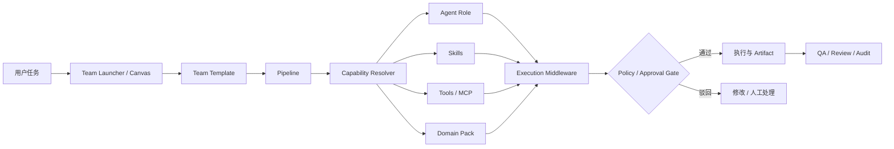

# T1 对象边界与术语规范

> 来源：`docs/architecture/agent-skill-domain-team-refactor.md`（T1、§3）
> 状态：基线版本 2026-08-15
> 目的：统一 Agent / Skill / Tool / Domain Pack / Team / Pipeline / Gate 的定义与边界，作为后续 Contract v2 与迁移的唯一术语来源。

## 1. 术语表

| 术语 | 定义 | 别称/禁止称呼 |
|---|---|---|
| Agent（执行角色） | 稳定的执行角色与责任主体，持有 persona、职责、模型策略、默认权限与可用能力范围 | 不叫“写手”“迁移 Agent” |
| Skill | 可复用的工作方法与专业能力，包含 instructions、输入输出、约束、评测与版本 | 不是可持有身份的 Agent |
| Tool | 对文件、浏览器、API、MCP 等外部系统的操作接口 | 不是业务人设 |
| Domain Pack | 领域知识、术语、规则与检索配置 | 不拥有外部副作用权限 |
| Team | 可复用的协作配置：lead、角色槽位、能力、协调策略与政策 | 不是运行实例 |
| Pipeline | 有依赖关系的执行过程：节点、输入输出、Gate、重试、Artifacts | 不是固定页面逻辑 |
| Gate | 运行时控制点：自动检查、人工审批、阻断条件、审计记录 | 不承担内容生成 |

## 2. 对象职责边界

| 对象 | 应包含 | 不应包含 |
|---|---|---|
| Agent | persona、职责、模型策略、默认权限、可用能力范围 | 具体平台模板、一次性任务流程 |
| Skill | instructions、输入输出、约束、评测、版本 | 密钥、登录状态、直接副作用权限 |
| Tool | schema、权限、风险等级、超时、审计 | 业务人设、长篇方法论 |
| Domain Pack | persona overlay、guidelines、knowledge IDs、disclaimer | 团队成员、执行顺序 |
| Team | lead、roles、skills、tools、domain、coordination、policy | 具体运行实例状态 |
| Pipeline | nodes、inputs、outputs、gates、retries、artifacts | 固定页面逻辑 |
| Gate | 自动检查、人工审批、阻断条件、审计记录 | 内容生成职责 |

## 3. 目标关系

## 4. 不变式（Invariants）

1. Agent 是执行主体；Skill、Tool、Domain Pack 不直接执行、不持有身份。
2. Team 表达“能力组合”，通过角色槽位挂载 Agent + Skills + Tools + Domain。
3. Pipeline 节点只声明 `roleSlot + requiredCapabilities`，由 Resolver 在运行前绑定具体实现。
4. 每次运行生成不可变 `ExecutionPlanSnapshot`，审计与重放只依赖快照。
5. 高风险操作（发布、写库迁移）必须经过 Gate，且默认 dry-run。
6. 旧 Agent ID 通过 alias 层兼容，历史记录保留原始 ID。

## 5. 命名与 ID 规则

- Agent id：稳定角色名（`content-creator`、`researcher`、`review`…），不使用平台名。
- Skill id：动词或能力名（`xiaohongshu-copywriting`、`social-publish-preflight`）。
- Tool id：`namespace.action`（`web.search`、`xiaohongshu-mcp`）。
- Team id：短横线小写（`xiaohongshu`）。
- 版本：Contract 使用语义化 `major.minor`（如 `2.0`）；Skill/Tool 使用 `x.y.z`。

## 6. 与现有实现的偏差记录

- 当前 `agents/registry.yaml` 中 18 个任务型 Agent 与本文档冲突，按方案分阶段迁移（先 alias、后隐藏、再删除）。
- 当前 `templates/*.yaml` stage 使用 `role:` 直接引用旧 ID，迁移前保留原文件，仅在 Resolver 层映射。
- 当前 Team 只有 `members`，升级为 v2 `roles` 时保留 `members` 作为兼容字段（见 compatibility 文档）。
